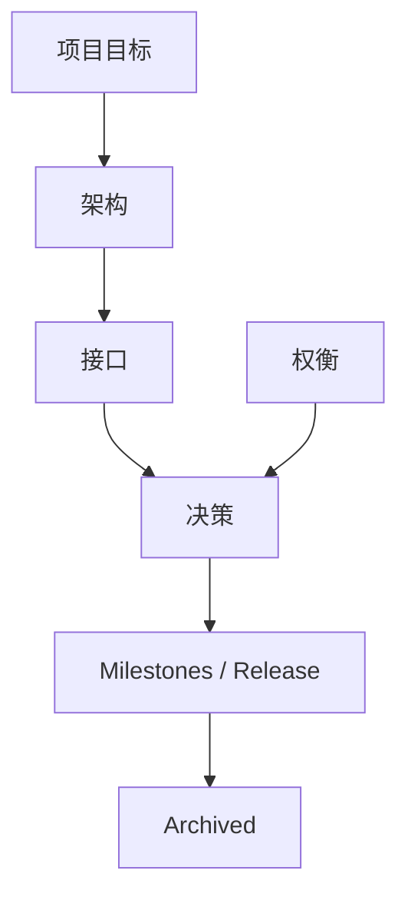

# pedyc-harness Documentation

> pedyc-harness 设计与工程文档地图。
>
> 本文件只负责导航,具体设计进入对应文档。文档的书写与检查规则见文档规范。
>
> **这里只到目录一级。** 每个目录的成员索引在各自的 `README.md` 里,导航完整性因此是传递的:
> `docs/README.md` → 目录 README → 成员。新增一篇文档只需要改它所在目录的 README。

## 开始

* [从零接入 Harness](./getting-started.md) — 端到端走查:接入、选预设、声明配置、跑一次
* [迁移到 1.2.0](./migrating-to-1.2.0.md) — 从「只有 policy.json」迁移到 `harness.json`,以及不迁移时的行为

## 规范

* [文档规范](./CONVENTIONS.md) — 目录语义、标题层级、链接与「当前/目标」标记约定
* [核心概念](./核心概念.md) — 术语表:每个概念的成熟状态与真实实现名

## 项目

* [项目目标](./项目目标.md) — 项目愿景、问题与边界
* [里程碑](./milestones/README.md) — 阶段划分、依赖关系、版本阶梯与状态
* [Release](./release.md) — 构建、版本、发布闸门与流程

## 目录

每个条目是该目录的索引入口;目录内成员列表在各自的 README 里。

* [架构](./architecture/README.md) — **系统结构**:是什么?什么时候执行?如何参与系统决策?
* [接口](./interfaces/README.md) — **接口契约**:类型、签名与模块边界
* [决策](./decisions/README.md) — **为什么**这么设计(ADR)
* [权衡](./tradeoffs/README.md) — 不同方案之间的**成本**
* [归档](./archived/README.md) — 过期或被替代的方案,**非规范**,仅用于追踪演进

## 文档关系

