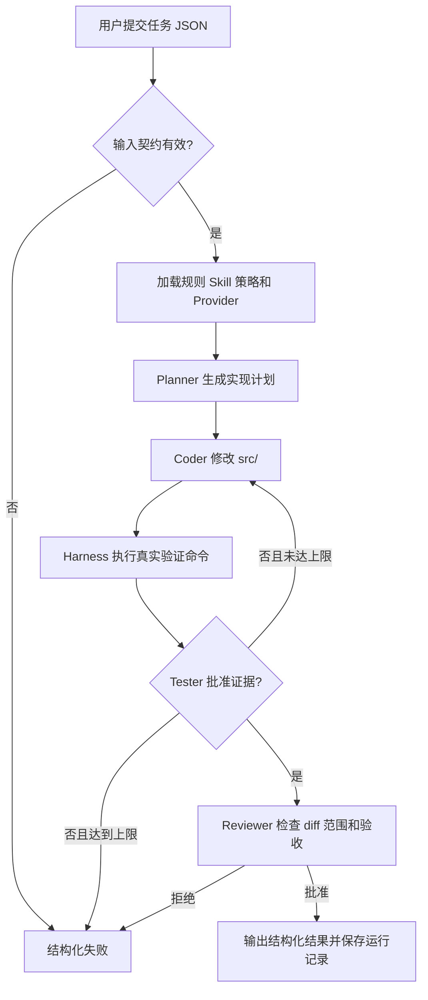

## SOP：搭建可验证的前端 Agent Harness

> 为 Vue 3 + TypeScript + Vite 项目建立受契约、权限和质量门禁约束的 Agent 开发闭环。
> **问题溯源**：本 SOP 是 [[Q-如何让 LLM 稳定完成前端开发任务]] 的收敛成果——经过规则分层、阶段式 Agent、自动验证和多 Provider 方案对比与实践验证，固化为标准流程。

### 目标与边界

目标：

- 在 Claude、Copilot 或其他 Agent Runtime 之上增加项目级工程约束，而不是重复实现模型和工具能力；
- 将自然语言任务转换为可校验的标准输入，并通过 Intake、Planner、Coder、Tester、Reviewer 形成可追溯闭环；
- 统一约束不同 Provider 的输入、输出、文件范围、命令权限和质量门禁；
- 用 Harness 实际执行的文件 diff、验证命令和阶段批准作为交付证据，避免只信任 Agent 的自报结果；
- 支持在不修改核心编排器的前提下切换 Provider，并为团队协作和 CI 提供可复现的运行记录。

边界：

- 本 SOP 聚焦 Vue 3 + TypeScript + Vite 项目中的项目级 Harness，不定义模型训练、Agent Runtime
  或企业级任务平台；
- Claude Code、VS Code Copilot 等负责模型推理、工具调用和代码操作；Harness 负责任务协议、
  阶段编排、权限策略、独立验证和最终裁决；
- 直接在 VS Code Agent 面板或 Claude 对话中输入任务，不会自动进入本项目 Harness，除非通过 CLI、
  Chat Participant 或其他集成入口显式调用 `run.mjs`；
- 当前示例使用三层输入模型：自然语言/简化任务输入 → Intake 补全与标准化 → 机器执行契约；
  交互式追问后的暂停恢复尚未实现；
- 当前执行器是固定的 Planner → Coder → Tester → Reviewer 管道，不是动态 Agent 集群；
- 当前已实现 Claude CLI Provider 和多 Provider 路由抽象，但 Copilot Provider 尚未实现；
- `evaluation.json` 当前是门禁声明，不是已经实现的综合评分系统；
- 当前没有真正的进程沙箱、任务队列、并发控制、断点恢复或 VS Code 对话桥接。

---

### 适用场景

- 场景 1：Vue 3 + TypeScript 项目需要让 Agent 稳定产出符合规范的组件或页面。
- 场景 2：多人协作时，需要统一 AI 的规则、权限、验证和交付格式。
- 场景 3：生产级前端变更必须经过类型检查、测试、构建、范围检查和代码审查。
- 场景 4：希望将一次性 Prompt 升级为可重试、可记录、可复用的任务管道。
- 场景 5：需要在 Claude、Copilot 或 API Provider 之间切换，而不修改核心编排器。

不适用：

- 一次性、低风险且不需要修改代码的问答或脚本；
- 没有稳定项目规范、无法定义验收标准的临时实验。

---

### 流程图解



规则和能力的加载边界如下：

```text
仓库规则 AGENTS.md
  → 目录级 AGENTS.md
  → 平台规则 .github/ / .claude/
  → 任务 Skill .agents/skills/
  → .harness/ 运行时契约和策略
  → Provider Adapter 工具与权限
```

规则的实际加载行为取决于 Provider。Harness 不假设 Claude、Copilot 和 API
Provider 具有相同的上下文加载机制，而是向 Adapter 传递统一的任务和运行时数据。

---

### 核心步骤

1. **建立分层工程结构**：将产品代码、Agent 规则、Skills、契约、策略和编排器分离。
     - 注意：`src/` 只放产品演示代码；`.github/`、`.agents/`、`.harness/`、`.claude/` 和 `scripts/` 默认受保护。
     - 关键目录：

       ```text
       AGENTS.md                         # 仓库级规则
       .github/                          # GitHub Agent、Instructions、CI
       .agents/skills/                   # 可复用任务 Skill
       .harness/                         # Schema、策略、Provider、运行记录
       scripts/harness/                  # run.mjs 和 Provider Adapter
       .claude/                          # Claude Code 入口规则
       tests/                            # 产品和 Harness 测试
       ```

2. **定义机器可读输入契约**：在 `.harness/input.schema.json` 中约束任务输入。
     - 必备字段：`feature`、`objective`、`acceptanceCriteria`。
     - 可选字段：`constraints`、`testHints`、`maxIterations`。
     - 验收标准必须可以通过命令、测试或文件检查验证。

     ```json
     {
       "feature": "Add a user profile card",
       "objective": "Display a typed user name, avatar, and role.",
       "constraints": ["Use Vue 3 script setup with TypeScript", "Keep changes under src/"],
       "acceptanceCriteria": [
         "The component accepts typed user data through props",
         "The component renders name, avatar, and role",
         "npm run type-check passes",
         "npm run build passes"
       ],
       "testHints": ["npm run type-check", "npm run build"],
       "maxIterations": 3
     }
     ```

3. **定义输出和阶段响应契约**：使用 `.harness/output.schema.json` 和
   `.harness/agent-response.schema.json` 约束最终结果与 Agent 响应。
     - 最终输出至少包含 `status`、`summary`、`implementationPlan`、`verification` 和 `issues`；
     - `verification` 每项包含 `command`、`result`、`details`；
     - Planner 必须返回非空 `implementationPlan`；
     - Tester 必须返回 `approved` 和结构化 `evidence`；
     - Reviewer 必须显式返回 `approved`。
     - Agent 的自然语言说明不能替代契约字段。

4. **配置策略和评估门禁**：在 `.harness/policy.json` 和
   `.harness/evaluation.json` 中声明边界。
     - 当前必需检查：`harness:verify`、`type-check`、`test:unit`、`build`；
     - 当前最大迭代次数为 3，Agent 超时为 300000ms；
     - 允许产品路径为 `src/`，保护目录包括 `.github/`、`.claude/`、`.agents/`、`.harness/` 和 `scripts/`；
     - 禁止危险命令，例如 `git reset --hard`、`git checkout --` 和 `npm publish`。
     - `evaluation.json` 的 `passThreshold` 目前只是设计目标；执行器采用必需门禁模式，不计算 0～100 的综合分数。

5. **抽象 Provider Adapter**：通过 `.harness/agents.json` 解耦 Agent 角色和模型后端。
     - 当前已实现 Claude CLI Provider；
     - Planner、Coder、Tester、Reviewer 通过 `provider` 字段引用后端；
     - 后续接入 Copilot 时新增 `copilot-adapter.mjs`，不修改核心编排器。

     ```json
     {
       "providers": {
         "claude": {
           "command": "node",
           "args": ["scripts/harness/claude-adapter.mjs"]
         }
       },
       "coder": {
         "mode": "external",
         "provider": "claude"
       }
     }
     ```

     Adapter 统一协议：

     ```text
     stdin  → 一个 Harness JSON 请求
     stdout → 一个 Agent JSON 响应
     exit 0 → 调用成功
     非 0   → 启动或执行失败
     ```

     stdout 只能输出协议 JSON，诊断日志写入 stderr。

6. **执行阶段式 Agent Pipeline**：
     - Planner：只读分析范围、文件、验收标准和风险；
     - Coder：只修改 `src/`，可以执行自检，但不能用自报结果替代独立验证；
     - Harness：执行策略中的真实命令并记录退出结果；
     - Tester：只审查 Harness 产生的验证证据；
     - Reviewer：检查实际 diff、范围、验收和高置信度缺陷。
     - 注意：当前是固定阶段管道，不是动态创建无限子 Agent。

7. **建立错误处理和重试策略**：
     - 输入错误（JSON 无效、缺少字段）：立即失败，不重试；
     - Provider 启动错误（CLI 不存在、权限拒绝）：当前阶段失败；
     - Agent 协议错误（非 JSON、Schema 不通过）：当前阶段失败；
     - Coder、类型检查、测试或构建失败：在最大迭代次数内反馈给 Coder；
     - Reviewer 拒绝：当前实现结束运行，不自动重新选择 Provider；
     - 超时：按策略结束当前调用。
     - 当前实现支持基础重试、结构化失败和运行记录，但不支持断点恢复或任务队列。

8. **收集证据并交付**：
     - 记录实际文件变化、命令退出结果、阶段状态、问题和迭代次数；
     - 将结果写入 `.harness/runs/<run-id>/`；
     - 只有输入、验证、范围和 Reviewer 门禁都通过，才输出 `passed`。

     证据可信度从低到高：

     ```text
     Coder 自报“已完成”
       < 实际文件 diff
       < Harness 命令退出码
       < Tester 对真实证据的批准
       < Reviewer 最终批准
     ```

---

### 实践/示例

#### 三层输入模型

开发者不需要直接手写完整的机器执行 JSON。输入分为三层：

```text
自然语言任务
  ↓
简化任务契约（task.schema.json）
  ↓
Intake：检查缺失信息并提出问题
  ↓
标准化执行契约（input.schema.json）
  ↓
Planner → Coder → Tester → Reviewer
```

简化任务示例：

```json
{
  "task": "Create a UserCard component",
  "goal": "Display a user's avatar, name, role, and description.",
  "scope": ["src/components/UserCard.vue"],
  "acceptance": [
    "The card renders the requested fields",
    "npm run test:unit passes"
  ],
  "specialConstraints": ["Prefer existing component patterns."]
}
```

Intake 会自动补充默认测试命令和最大迭代次数；如果缺少任务、目标或验收标准，
则返回结构化问题，不启动 Agent Pipeline。当前 CLI 只返回问题，交互式问答和暂停恢复
可由 VS Code Chat 或前端入口在后续接入。

#### 运行检查

```powershell
npm run harness:verify
npm run test:unit
npm run type-check
npm run build
```

#### 安全预览

```powershell
node scripts/harness/run.mjs --input .harness/task.example.json --dry-run --json
```

#### 运行真实 Harness

```powershell
node scripts/harness/run.mjs --input .harness/task.example.json --json
```

结果会输出为 JSON，并保存到：

```text
.harness/runs/<run-id>/output.json
```

同一目录还包含：

- `input.json`：任务输入快照；
- `policy.json`：策略快照；
- `iteration-<n>-verification.json`：每轮真实验证结果。

#### 一次组件任务的执行流

```text
用户提交任务 JSON
  → 校验 input.schema.json
  → Planner 生成计划
  → Claude Coder 修改 src/components/UserInfo.vue
  → Harness 执行 harness:verify、type-check、test:unit、build
  → Tester 审查真实结果
  → Reviewer 审查 diff 和验收
  → 通过交付；失败则回到下一轮 Coder
```

---

### 常见坑点

- ⛔ **把 Harness 五要素和 Agent 四层治理混为一谈**：前者是运行时闭环，后者是治理维度。
- ⛔ **把规则加载顺序当成所有 Provider 的统一行为**：不同 Provider 的上下文加载机制可能不同。
- ⛔ **把 Coder 自报结果当作验证证据**：必须由 Harness 执行命令，Tester 审查真实结果。
- ⛔ **只写 `type-check` 和 `build`**：当前项目还要求 `harness:verify` 和 `test:unit`。
- ⛔ **把 `passThreshold` 当成已实现评分**：当前 evaluation 只声明门禁，不计算综合分数。
- ⛔ **让 Adapter 把日志混入 stdout**：stdout 只能有一个 JSON 响应，日志写 stderr。
- ⛔ **让 Coder 修改 Harness 配置**：默认只允许修改 `src/`。
- ⛔ **把阶段式管道称为动态子 Agent 系统**：当前没有任务队列、并发和任意 Agent 生成。

- 🔧 **如果输入校验失败**，检查 `input.schema.json` 的必需字段和 JSON 格式。
- 🔧 **如果 Agent 响应失败**，检查 stdout 是否为单个 JSON、阶段字段是否完整、Adapter 是否返回非零退出码。
- 🔧 **如果验证失败**，检查 `.harness/runs/<run-id>/iteration-<n>-verification.json` 的实际命令结果。
- 🔧 **如果出现越权修改**，检查 `policy.json` 的 `allowedProductPaths` 和实际 diff。
- 🔧 **如果 Claude 无法启动**，检查 CLI 安装、认证、Provider 命令和终端权限。
- 🔧 **如果 npm 参数异常**，优先直接调用 `node scripts/harness/run.mjs`，不要依赖 npm 11 的参数转发。

---

### 重构前后评估

#### 重构前优点

- 信息覆盖面广，包含架构、Schema、Agent 提示词、策略、实践和坑点；
- 对实现细节描述充分，便于熟悉项目背景；
- 已经包含多 Provider、证据链和实现边界等重要内容。

#### 重构前缺点

- 设计目标、当前实现和未来规划混在一起，容易误判完成度；
- 标题层级和信息粒度不统一，阅读路径不够明确；
- Harness 五要素、Agent 四层治理、规则加载顺序和执行管道混在同一叙述中；
- 原有流程图更偏概念图，没有清楚表达失败分支、重试上限和最终证据；
- `evaluation.json` 的 `passThreshold` 容易被误解为已经存在的评分系统；
- Provider 抽象、Tester 独立验证和错误分类没有成为主线。

#### 重构后优点

- 完全对齐 SOP 模板，读者可以按“目标 → 场景 → 流程 → 步骤 → 示例 → 坑点”阅读；
- 明确区分目标、边界、已实现、当前限制和 Provider 规划；
- 将规则治理流程、任务执行流程和证据链分开；
- 将输入契约、输出契约、策略、评估、Adapter 和错误处理集中到核心步骤；
- 如实采用方案 A，明确当前没有综合评分实现；
- 将实际命令、运行记录、目录边界和阶段职责保留下来；
- 使用错误分类表和可信度排序，降低误用风险。

#### 重构后的代价与补偿

- 为了符合模板，完整 JSON Schema 和四个 Agent 文件没有全部内嵌，细节需要回到仓库文件查看；
- 原文的长提示词示例被压缩为职责和协议，适合 SOP，但不适合作为 Prompt 参考手册；
- 未来应将详细 Schema、Provider 协议和故障案例拆成关联笔记，避免主 SOP 继续膨胀。

---

### 知识图谱

- **相关概念**：
    - [[Harness]]
    - [[Agent]]
    - [[Provider Adapter]]
    - [[Claude Code]]
    - [[Copilot]]
    - [[Vue]]
    - [[提示词工程]]
- **问题来源**：
    - [[Q-如何让 LLM 稳定完成前端开发任务]] — 本 SOP 解决的核心问题来源
- **实现参考**：
    - [README.md](../README.md)
    - [run.mjs](../scripts/harness/run.mjs)
    - [claude-adapter.mjs](../scripts/harness/claude-adapter.mjs)
    - [agents.json](../.harness/agents.json)
