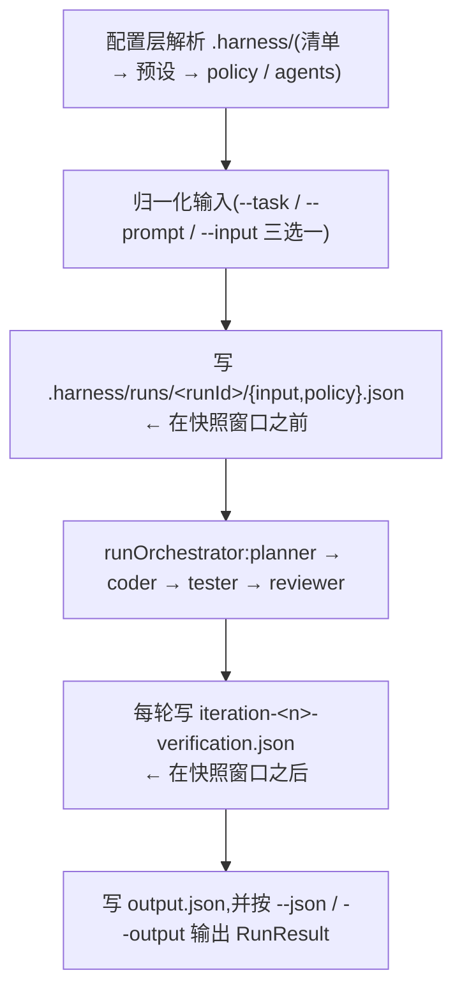
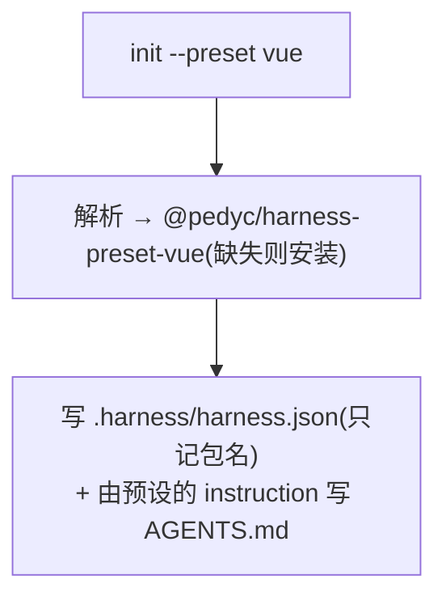

# CLI 架构

> CLI 是用户入口,也是唯一会**改动目标项目文件**的组件。
>
> 参数、写入产物与退出码见 [CLI 契约](../interfaces/cli.md)。本目录只回答:是什么、什么时候执行、
> 如何参与决策。

## 1. 是什么

CLI 有两个身份:

1. **项目初始化器** —— `init` / `update` 把 Preset 展开成目标项目里的治理文件。这是唯一会写目标
   项目文件的路径,也是把「治理模型属于项目本身」这条原则落地的地方。
2. **运行入口** —— `run` 读取配置、驱动编排、写出运行记录。

CLI 本身**不承担治理判定**。Policy 校验、范围检查、闸门执行、阶段通过与否全部委托给 Core。

## 2. 命令与时机

| 命令 | 什么时候用 | 是否写文件 |
| ---------------- | -------------------------------- | ---------------------------------- |
| `init` | 新项目接入 Harness | 写;已存在且内容不同则跳过 |
| `diff` | 想先看会改什么 | **不写** |
| `update` | CLI 契约文件(模板与 schema)改版后同步 | 写 `missing`;`modified` 需要 `--force` |
| `verify` | 提交前、CI | 不写 |
| `list-presets` | 想知道项目跟随了哪些预设,以及它们各自的继承 | 不写 |
| `doctor` | 排查环境与配置来源 | 不写 |
| `run` | 执行一次任务 | 写运行记录,可能改产品文件 |

`init` 的幂等规则是整套流程的基础:**不存在则创建,已存在且相同则跳过,已存在且不同则保留并提示,
只有显式 `--force` 才覆盖。** 因此重复执行 `init` 是安全的,也不会静默覆盖用户改过的配置。

## 3. 一次 `run` 里 CLI 做什么

CLI 是编排的宿主,但每个阶段的判定都在 Core:

CLI 在这里的职责是**准备与记录**:准备配置与任务,记录运行产物。它不做通过与否的判断。配置在
任何阶段执行之前解析完毕——一个无法解析的项目绝不会被部分执行,也不会在与 Agent 交互到一半时
才发现配置有问题(退出码 `5`)。

一个容易忽略的细节:CLI 在编排开始前写 `input.json` / `policy.json`,在编排结束后写
`output.json`,所以这些文件**不会**被误判成 Coder 的产品改动——范围判定窗口恰好是一次 Coder 调用。

## 4. 如何参与决策

CLI 不产生治理判定,但有两个决策点由它实现:

| 决策 | 位置 | 内容 |
| -------------- | -------------- | -------------------------------------------------------- |
| 配置是否可用 | `verify` | schema 齐全、JSON 可解析、Policy 合法、闸门脚本存在 |
| 输入是否充分 | `run` 的 intake | `needs_input` 时打印问题并停止,而不是替用户猜 |

intake 的行为值得注意:缺少目标或验收标准时**不报错**,而是转成待回答的问题。这让「信息不足」
与「执行失败」成为两种不同的结果——前者可以补信息后重跑,后者需要修配置或代码。

`verify` 还有一个可扩展点:若项目存在 `.harness/verify.mjs`,CLI 会以 `--root <项目根>` 调用它,
并**透传它的退出码**。这条钩子只在 `verify` 中执行,`run` 流程不会调用它。

## 5. `doctor` 报告环境与配置来源

`doctor` 先打印四行环境信息(项目根、配置是否存在、包管理器、Node 版本),随后列出**配置来源**:
每条的 `kind`、`location` 与 `active`,为 `false` 时标注 `(declared, not yet consumed)`。

来源列表才是重点:**一次运行实际会用到哪些值**原本不可见,而回退到内置默认值与刻意配置在外观上
完全一样。配置无法加载时 `doctor` 报告错误并以退出码 `5` 结束,而不是给出一份看起来健康的报告。

它仍然**不做断言**——Provider 未配置或闸门脚本缺失是 `verify` 的职责。把它当作排查的起点。

## 6. 与 Preset 的关系

`init` 是 Preset 的**唯一消费者**,当前语义是「声明 + 安装」,而不是复制内容:

Preset 的内容(policy / agents)由解析器在**运行时**从包内读取,**不进入目标项目**——这正是升级
预设时不会覆盖项目自身修改的原因。schema 与示例任务来自 CLI 内置模板,**与 Preset 无关**。

`--preset` 按约定展开:`vue` → `@pedyc/harness-preset-vue`,任何含 `/` 的值本身就是包名,因此团队与
第三方预设一旦安装即可使用,CLI 里没有预设表。见 [Preset 架构](./preset.md)与
[Preset 契约](../interfaces/preset.md)。

## 7. 已知限制

| 限制 | 说明 |
| ---------------- | ---------------------------------------------------------------- |
| 退出码仅三档 | `0` 成功、`1` 失败、`5` 配置问题;更细的分类仍属规划中 |
| 无审批交互 | 不存在人工审批门;`run` 不会中途停下来等人 |
| 无 `--host` 概念 | CLI 面向单机一次性任务,不是常驻服务 |

> **目标(M9/M10)** 「等待审批」运行状态与更细的退出码分类属于规划中,当前**未实现**。

## 8. 相关文档

- [CLI 契约](../interfaces/cli.md) — 参数、产物与退出码
- [系统架构](./system.md) — 四阶段循环全貌
- [Preset 架构](./preset.md) — `init` 展开的内容来自哪里
- [Release](../release.md) — 发布前如何验证 CLI 本身
