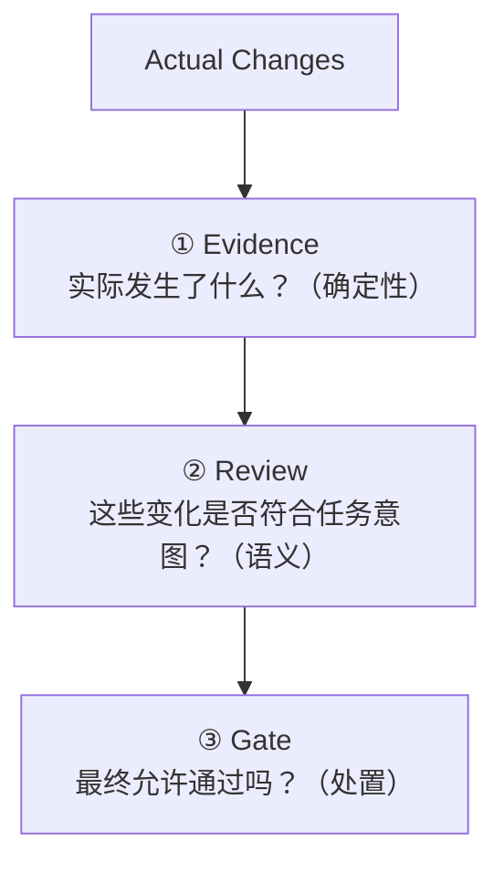
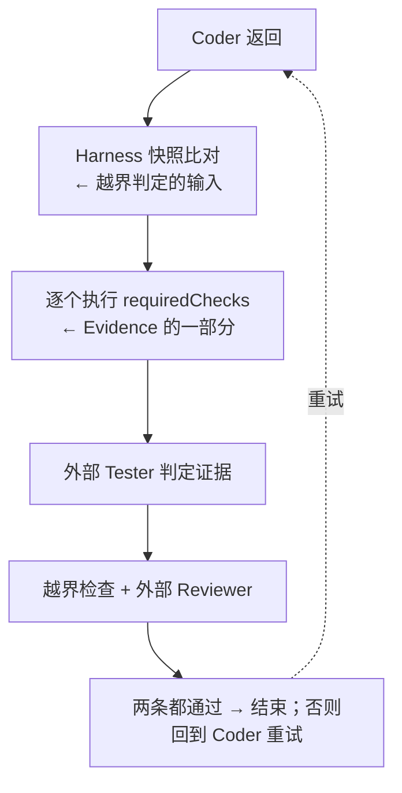

# 治理流水线：Evidence → Review → Gate

> 一次 Run 里"这次变化该不该被接受"是如何被回答的。
>
> 三层各自的契约见 [验证契约](../interfaces/verification.md) 与 [Policy 契约](../interfaces/policy.md)；
> 本文件回答：三层各是什么、什么时候执行、如何参与系统决策。
>
> 标注约定见[文档规范](../CONVENTIONS.md)：现在时陈述表示**已实现**，目标形态一律显式标注。

## 1. 是什么

治理流水线是 Harness 对一次改动做出"接受 / 不接受"判定的完整链路：



它建立在整个系统唯一的信任规则之上：

> **Agent 的自我描述不是独立验证证据。**

因此三层的执行者被刻意分开：Evidence 由 Harness 自己产生，Review 由外部 Agent 产生，Gate 由 Harness
根据声明好的 Policy 得出。任何一层都不能替代另一层。

## 2. 为什么是三层

| 问题类型           | 例                                             | 可靠执行者 | 原因                             |
| ------------------ | ---------------------------------------------- | ---------- | -------------------------------- |
| 确定性事实         | 改了哪些文件、命令退出码、新增了哪些依赖、AST 结构 | 脚本       | 有确定答案，LLM 只会引入噪声     |
| 语义判断           | 这段复杂度是否是任务需要的、是否满足验收意图     | LLM        | 需要结合 Task 与验收标准理解     |
| 处置               | 这个问题该拒绝、该复核、还是只记录             | Policy     | 属于治理声明，必须可审计、可复用 |

这正是[成本权衡](../tradeoffs/成本权衡.md) 的原则："确定性问题交给脚本，语义问题交给 LLM"。治理流水线是
这条原则的执行结构。

### 2.1 三级检查

| Level | 内容                                                             | 执行者             | 产物               | 信任等级                              |
| ----- | ---------------------------------------------------------------- | ------------------ | ------------------ | ------------------------------------- |
| 0     | Policy、Scope、Diff、Typecheck、Lint、Test、Build、AST、依赖分析 | Harness            | Evidence           | `harness-executed` / `analyzer-derived` |
| 1     | 复杂度、文件数、依赖数、抽象深度、改动 LOC → 可解释的分数        | Harness            | Evidence（分数 + 贡献项） | `analyzer-derived`              |
| 2     | 结合 Task 与改动的语义判断                                       | Harness 调度，Provider 执行 | Findings    | `review-derived`                      |

三级**首先是证据可信度分层，其次才是成本分层**：不要让模型回答脚本能回答的问题。Level 1 的分数
必须可解释——列出哪几条事实、各贡献多少，否则它与模型自报的置信度一样不可复核。

### 2.2 触发

```text
触发 = Level 0 规则命中 OR Level 1 分数超过阈值
```

单一分数阈值不作为唯一触发条件：复杂度信号低但语义违规的改动，正是"不能只看分数"的那一类。分数
与 `confidence` 都**不参与判定**，它们只用于排序与路由到人工。

被触发的多条语义检查**按轮批量合成一次调用**，调用次数由触发决定，而不是由检查条数决定。
决策与取舍见 [ADR-005](../decisions/ADR-005-semantic-governance.md)。

## 3. 三层职责

| 层           | 输入                                                   | 输出                     | 执行者                                    |
| ------------ | ------------------------------------------------------ | ------------------------ | ----------------------------------------- |
| ① Evidence   | 快照 diff、命令执行结果、（目标）Preset 注册的分析器     | Evidence 列表（带信任等级） | Harness 执行；分析器由 [Preset](./preset.md) 注册 |
| ② Review     | Task、验收标准、Evidence、实际改动                       | Findings（结构化）        | 外部 Agent（`reviewer` 阶段）             |
| ③ Gate       | Findings、越界判定、Policy（severity → action）          | 通过 / 重试 / 终止        | Harness                                   |

三层的产出都必须落盘，构成 M9 的审计链：证据 → findings → 判定。

## 4. 什么时候执行

当前一次迭代的顺序（已实现）：



> **目标（M7、M8）** 目标形态在这条链路上插入两处：`requiredChecks` 之外增加 Preset 注册的
> Evidence Provider，产出带信任等级的 Evidence；Reviewer 的输出从 `approved: boolean` 升级为
> Findings 列表，再由 Gate 按 `severity → action` 处置。**以上均未实现**，见
> [里程碑路线](../milestones/milestones.md)。

## 5. 如何参与决策

### 5.1 合取，不是投票

通过条件是若干**独立**条件的合取，当前实现为：

```text
通过 = 所有闸门 pass && Tester approved && Reviewer approved && 无越界改动
```

要点：

* Agent 的 `approved` 不能替代 Harness 的执行结果，也不能抵消越界；
* 越界判定由 Harness 做，交给被检查的一方没有意义；
* `requiredChecks` 为空时"全部通过"是空真，等于验证形同虚设。

### 5.2 Findings 的处置

> **目标（M7、M8）** 每条 Finding 按其 rule id 在 Policy 中解析出 severity 与 action，默认映射为
> `error → reject`、`warning → review`、`info → report`。

处置只决定"这次判定算不算通过"，不改变证据本身。关键推论：

* `info` 不影响判定，只进入记录；
* `warning` 需要 Reviewer 明确确认，未确认即不通过；
* `error` 不通过。

### 5.3 回流语义

> **目标（M8）** 当前唯一的重试通道是 Tester 失败后把上一轮 `verification` 交回 Coder。目标形态把
> 它扩展为"结构化 Findings 回流"：

| 情况                             | 行为                                       |
| -------------------------------- | ------------------------------------------ |
| 可修复的 `error` / `warning`     | 回 Coder 重试，携带上一轮 Findings（结构化） |
| 不可修复的 `error`               | 终止运行                                   |
| 越界改动、受保护路径命中         | 立即终止，不重试                           |
| 没有任何 Evidence                | Reviewer 不得批准                          |

"可修复"由 Finding 自身声明，不由 Agent 事后解释。任何情况下都不允许把自然语言总结当作回流内容。

### 5.4 独立性

> **目标（M8）** Reviewer 本身是一个 Agent，因此它凭什么可信必须被显式回答。已确定的部分：

* Reviewer 只是合取中的一票，不能单独放行；
* Reviewer 必须消费 Task + 验收标准 + Evidence + 实际改动，而不是只看 Agent 自述；
* 规则实现（包括 LLM 无法可靠判断的确定性部分）不交给 Reviewer。

> **目标（M8）** 同源问题（Reviewer 与 Coder 是否同一 Provider、同一模型）由一个结构决定：模型调用
> 由 Harness 调度而不是由 Preset 发起（见 [ADR-005](../decisions/ADR-005-semantic-governance.md)），
> 因此"语义审查不得与 Coder 同源"可以成为一条**可校验**的约束，而不是一句建议。目标是让
> `agents.json` 能声明它、并让运行记录能审计它；今天它只按 role 配置 Provider。

## 6. 证据的信任等级

> **目标（M8）** Evidence 必须携带来源，按可信度排序：

| 等级                | 产生者                                   | 例                                     |
| ------------------- | ---------------------------------------- | -------------------------------------- |
| `harness-executed`  | Harness 亲自执行                         | 闸门命令、快照 diff                     |
| `analyzer-derived`  | Harness 或 Preset 的确定性分析器          | 依赖解析、AST 结构、复杂度分数          |
| `review-derived`    | Harness 派发的语义审查（Provider 执行）   | "可能的过度设计"及其理由与证据          |
| `agent-claimed`     | Agent 自述（被检查方自己说的）            | "测试都通过了"                          |

前三级可以参与判定；`agent-claimed` 只能作为线索进入上下文。`review-derived` 与 `agent-claimed`
必须分开记录：前者是 Harness 主动派发、由另一个执行者产出的观察，后者是被检查方的自我描述。等级
本身必须写进记录，否则审计无法回答"这条结论凭什么可信"。

## 7. 现状与目标对照

| 能力                        | 当前                                             | 目标                            |
| --------------------------- | ------------------------------------------------ | ------------------------------- |
| 确定性证据                  | 文件级快照 diff + 闸门 `pass`/`fail`             | 结构化 Evidence（命令、退出码、耗时、摘要） |
| 分析器扩展                  | 无                                               | Preset 注册 Evidence Provider（M21 + M8） |
| 证据信任等级                | 无                                               | 四级来源标记（M8）              |
| 语义判断                    | 外部 Reviewer 返回 `approved: boolean`           | Findings 列表（M8）             |
| 语义审查触发                | 每轮固定调用一次 Reviewer                        | 规则命中或分数阈值触发，按轮批量合成一次调用（M8） |
| 模型来源                    | 由 role 直接配置，Preset 无法参与                | Preset 声明需求、Harness 选择 provider（ADR-005） |
| 预算与禁用                  | 无                                               | warning 可跳过并记录、error fail-closed、禁用入 Run Record（M8） |
| 处置                        | 越界一票否决 + 全闸门通过                         | Policy 的 severity → action 映射（M7） |
| 回流                        | 上一轮 `verification` 回 Coder                   | Findings 结构化回流（M8）       |
| Reviewer 独立性             | 未定义                                           | 可声明、可审计（M8）            |
| 记录                        | `iteration-<n>-verification.json` + `output.json` | 统一证据模型与 provenance（M8、M9） |

## 8. 失败模式

| 失败                           | 表现                                     |
| ------------------------------ | ---------------------------------------- |
| 闸门脚本不存在                 | 配置闸门失败，并列出缺失的脚本名         |
| 闸门非零退出                   | 该条记为 `fail`，说明取 stderr           |
| Evidence 为空                  | Reviewer 不得批准；运行不通过            |
| Reviewer 拒绝                  | 即使闸门全绿也不通过                     |
| 改动越界                       | 立即终止，即使 Reviewer 批准             |
| Finding 为 `reject` 且不可修复 | 终止，不重试                             |
| 超出重试上限                   | 运行失败，记录"未在上限内通过验证"       |
| 预算耗尽且检查为 `warning`     | 记为 `skipped`，运行继续，跳过事实进记录 |
| 预算耗尽且检查为 `error`       | fail-closed：不通过                       |
| 语义审查被显式禁用             | 记录禁用状态与该层未覆盖，不能静默通过   |

## 9. 边界

治理流水线**不负责**：

* 调用 Agent（那是 Provider）；
* 判断视觉美观或主观风格——Review 只回答"新增的复杂度是否有任务依据"；
* 决定"发现什么"（那是规则实现与 Evidence Provider）；
* 决定用哪个模型、哪份凭证（那是 Provider 配置；流水线只声明"需要语义分析"）；
* 负责预算的算术与阈值调参（属于[成本权衡](../tradeoffs/成本权衡.md)；**触发结构**属于本层）。

它只回答"这次变化能不能被接受"，并把结论与依据交给编排层与审计记录。

## 10. 相关文档

* [验证契约](../interfaces/verification.md) — Evidence、Findings 与通过条件
* [Policy 契约](../interfaces/policy.md) — severity 与 action 的声明形状
* [Verification 设计](./verification.md) — 两条闸门与角色分工
* [Policy 设计](./policy.md) — 规则层与统一 Evaluator
* [Preset 设计](./preset.md) — 分析器与审查定义如何被 Preset 注册
* [系统架构](./system.md) — 四阶段循环中的位置
* [ADR-003](../decisions/ADR-003-preset-as-code.md) · [ADR-004](../decisions/ADR-004-policy-severity-rules.md) ·
  [ADR-005](../decisions/ADR-005-semantic-governance.md)
