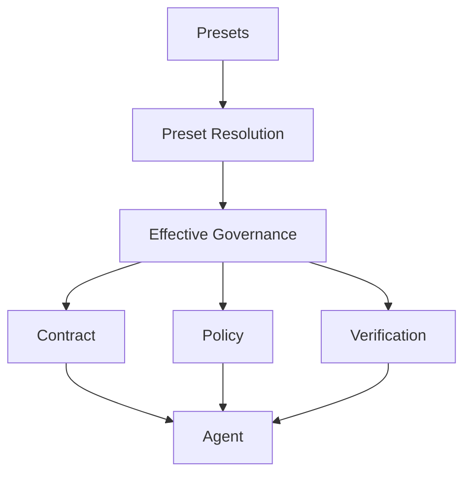
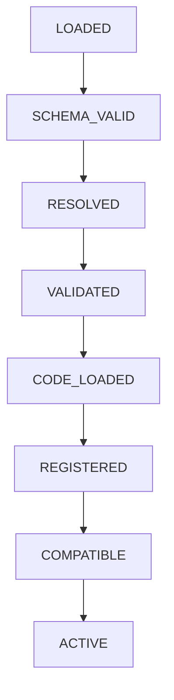
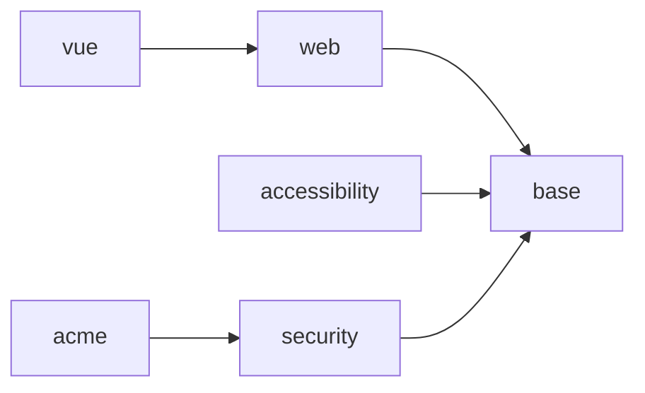
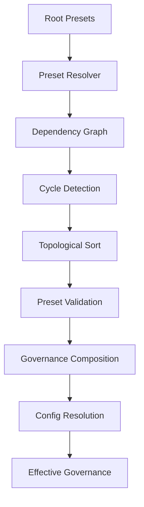
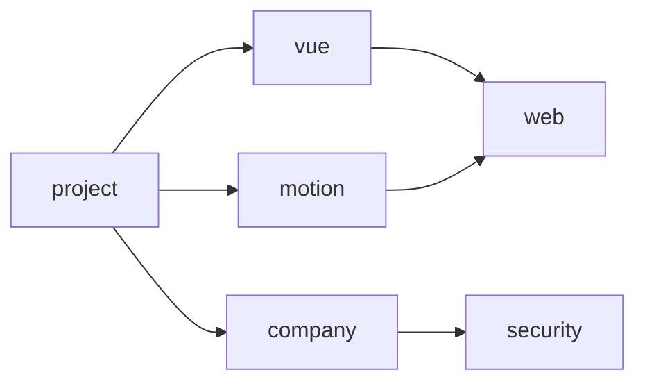
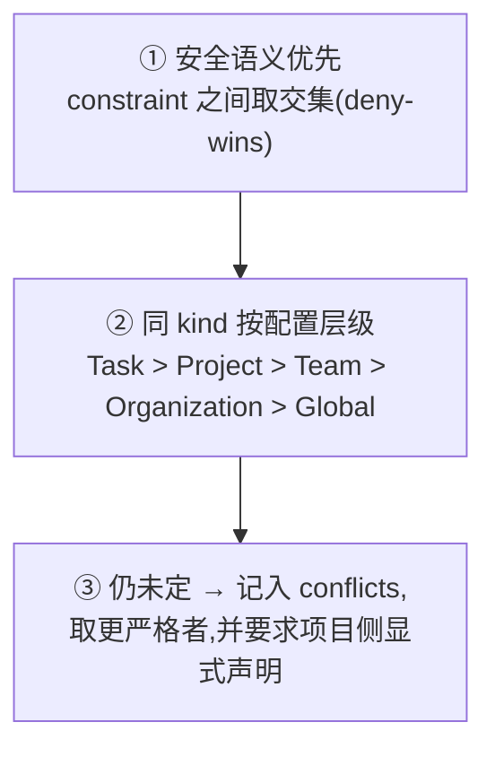

# Preset 架构

> Preset 是可复用、可继承、可组合的 Harness 治理规范(Governance Specification)。它定义特定技术栈、
> 领域或组织环境下,Agent 任务应遵守的 Contract、Policy、Rules、Verification 与 Agent Guidance。
>
> Preset 不属于 Core,也不让 Core 感知具体技术栈或业务领域。
>
> **本文同时包含现状与目标。** §7(npm 分发与 `preset.json`)、§9(依赖图与解析)以及 §15 的 Init
> 部分**已经实现**;配置层级、字段级合并语义、安全模型与 provenance(§10–§12、§14)仍属**目标**;
> §8(代码 Extension Contract)是 M21 的目标形态。§16 给出逐项对照,契约形状见
> [Preset 契约](../interfaces/preset.md)。

## 1. 定位

pedyc-harness 负责定义、执行并验证治理模型;Preset 提供**具体场景下的治理规范**:

```text
Core     →  通用治理能力
Preset   →  具体治理规范
```

`@pedyc/harness-preset-vue` 描述 Vue 项目该如何治理,`@pedyc/harness-preset-motion` 描述动效代码应
满足什么规范,`@acme/harness-preset` 描述公司项目应遵守的组织规则。Core 不需要理解 Vue、Motion、
Security 这些词,它只理解统一的 Harness Domain Model。

## 2. Preset 不只是 Default Config

把 Preset 理解为「一组默认配置」过于狭窄。它描述的是**「什么样的任务执行与最终结果符合该规范」**:

| 治理层 | 内容 |
| ---------------- | -------------------------- |
| Contracts | 任务应满足的契约模板 |
| Policies | 允许与禁止做什么 |
| Rules | 领域规则(含默认严重级别) |
| Verification | 该领域如何验证 |
| Evidence | 该领域有哪些确定性分析器 |
| Review | 该领域该如何审查(提示词与期望的结构) |
| Agent Guidance | 面向 Agent 的规范说明 |
| Dependencies | 继承与组合关系 |

前六层是"可被机器消费"的治理内容:前四层是声明,后两层(Evidence、Review)通常需要实现,因此
Preset 可以是代码(§8)。Agent Guidance 是唯一只面向 LLM 的一层。

以 `motion-preset` 为例,它可以规定动画时长范围、easing 约束、可用的动画 API、禁止的动画模式、
reduced-motion 要求与动效验证规则。Agent 依据这些规范生成代码,Harness 则进一步判断生成结果是否
符合规范。因此 Preset 的实际治理能力由三部分共同构成:

```text
LLM Guidance  +  Machine-enforced Policy  +  Independent Verification
```

## 3. 三种主要类型

Preset 不应该只按技术栈分类:

| 类型 | 描述什么 | 例子 | 典型内容 |
| ---------------- | -------------------- | ------------------------------ | ------------------------------------------------------------ |
| Technology Preset | 具体技术栈的治理规范 | `@pedyc/harness-preset-vue` | Project Rules、Typecheck 与 Build 验证、框架 Guidance、项目模板 |
| Domain Preset | 某个工程领域的规范 | `@pedyc/harness-preset-motion` | 领域规则,以及该领域应该如何验证 |
| Organization Preset | 组织、团队或公司级规范 | `@acme/harness-preset` | 禁止 push、禁止修改 CI、必须通过安全检查 |

关键在于 **Domain Preset 与技术栈正交**:motion-preset 不关心项目是不是 Vue,它可以同时用于 Vue、
React、Svelte 与原生 Web。Organization Preset 则通常按 Company → Team → Project 逐层继承。

## 4. Composition

一个项目可以同时使用多个 Preset:

```text
projectA
├── Vue Preset
├── TypeScript Preset
├── Motion Preset
├── Accessibility Preset
└── Company Preset
```

它们经 Resolution 合成 Effective Governance,再分发给 Runtime 的三个消费面:



Preset 是治理体系的**规范来源层**。

## 5. Preset 与其余组件的边界

Preset 提供规范,Runtime 提供机制。这条分工贯穿所有组件:

| 组件 | Preset 提供 | Runtime 负责 |
| -------------- | ------------------------------------------ | ---------------------------------------------- |
| Agent | Agent Guidance(规范说明) | 调用 Agent |
| Contract | Contract 模板 | 最终 Task Contract 仍属于任务本身 |
| Policy | 领域策略(允许/禁止的 API 与文件范围)与规则默认级别 | 强制执行与判定 |
| Verification | 该领域**应该如何验证** | 何时执行、如何执行、如何记录证据、如何参与 Gate |
| Evidence | 确定性分析器(实现) | 何时运行、如何记录、赋予什么信任等级 |
| Review | 审查规范与提示词(实现) | 调用 Reviewer、汇总 Findings、按 Policy 处置 |

两条必须守住的边界:

- **Agent Guidance 不能替代机器可执行约束。** 规范写在 Guidance 里,Agent 可能遵守也可能不遵守;
  因此每条规范都应尽可能有对应的、可机器验证的约束。
- **Preset 不替代 Task Contract。** 具体任务的目标与验收标准属于任务,不属于 Preset。
- **Preset 提供能力,Harness 决定何时使用。** 即使 Preset 提供的是代码(§8),运行时机、证据记录与
  最终判定仍属于 Runtime,见[治理流水线](./governance.md)。

> **红线:Preset 只能定义「Agent 应该如何被治理」,不能定义「Agent 应该如何工作」。**

可执行的形式就是 §8.1 的**封闭注册面**(治理默认值、验证定义、Evidence Provider、语义治理需求、项目
模板)加上 §8.2 的约束。面外的一切——agent loop、工具编排、memory、scheduling、UI——都不是 Preset
能声明的东西。判据是资源而不是名词:需要 Harness 独占执行资源(进程、模型、凭证、会话状态)的只能
**声明**,纯计算才可以注册为代码,见 [ADR-005](../decisions/ADR-005-semantic-governance.md) §2.6 与
[项目目标](../项目目标.md) 原则 19。

## 6. Runtime 的边界

Runtime 不应该直接理解 Preset:

```ts
if (preset === "vue") { ... }            // 错误
if (project.type === "motion") { ... }   // 错误
```

正确的关系是 `Preset → Resolver → Effective Governance → Runtime`。Runtime 只消费合成结果,不需要
知道某条规则来自哪个 npm 包、是 Vue 还是 Motion Preset、是 Company Preset 还是 Project Config——
这些信息由 Provenance 单独保留(见 §14)。

Runtime **不负责** Preset Discovery、Package Management、Dependency Resolution 与 Version
Management,这些属于配置与 Resolution 层。

## 7. Preset Package 与 Manifest

Preset 使用 npm package 分发,它是治理规范的分发单元,**不是 Runtime Plugin**——即使它携带代码
(§8),它注册的也是 Harness 定义的扩展点,而不是替换 Runtime 的部件:

```text
@acme/harness-preset/
├── package.json
├── preset.json          # Manifest:继承关系、资源路径与本包入口(§8)
├── contracts/
├── policies/
├── verification/
├── evidence/            # 可选:确定性分析器(代码)
├── reviewers/           # 可选:审查定义与提示词
├── rules/
└── guidance/
```

`preset.json` 声明继承与各类资源的相对路径:

```json
{
  "name": "@pedyc/harness-preset-motion",
  "extends": ["@pedyc/harness-preset-web"],
  "contracts": ["./contracts/animation.json"],
  "policies": ["./policies/motion.json"],
  "verification": ["./verification/motion.json"],
  "rules": ["./rules/motion.md"],
  "guidance": ["./guidance/generation.md"]
}
```

相对路径只能引用当前 Preset Package 内的资源。版本不由 Preset Reference 管理,而由 `package.json`
与 lockfile 承担,避免同一版本号出现在三处(见 [Release](../release.md))。

## 8. Preset 是代码:Extension Contract

> **目标(M21)** 本节描述目标形态,**尚未实现**。现状见 §16。

纯数据的 Preset 只能换几份 JSON:一旦需要自定义分析器、结构化审查规则或生成逻辑,就只能绕开
Preset,把实现塞进 Provider 或项目脚本——两者都在治理链之外。因此 Preset 可以是代码,但代码只能
进入封闭的 **Extension Contract**,理由与取舍见 [ADR-003](../decisions/ADR-003-preset-as-code.md)。

### 8.1 注册面

Preset 只能注册下列能力,注册面之外没有入口:

| 扩展点 | 注册物 | 消费方 |
| -------------- | -------------------------------------------------- | ------------------------------------------ |
| 治理默认值 | Policy 默认值、规则声明(rule id 与默认严重级别) | Policy Evaluator |
| 验证定义 | `requiredChecks` 与检查定义 | 验证闸门 |
| 证据提供者 | Evidence Provider(确定性分析器,**代码**) | [治理流水线](./governance.md) 的 Evidence 层 |
| 语义治理需求 | `SemanticVerification` 声明(提示词 + 触发条件 + 默认级别,**数据**) | Review 层与 Semantic Engine |
| 项目模板 | 模板、Agent Guidance、skills、agents 默认值 | `init` / `diff` / `update` |

注册面按**是否独占资源**分类:需要模型、凭证与网络的扩展点只能声明,纯计算能力才能注册代码。
Preset **不携带**可执行验证脚本——`requiredChecks` 仍然只指向目标项目自己的 npm 脚本,由 Harness
在命令策略下执行。理由与取舍见 [ADR-005](../decisions/ADR-005-semantic-governance.md)。

### 8.2 四条边界

- Preset 提供实现,Runtime 决定何时执行、如何记录、如何参与 Gate——与 §4、§5 的分工一致。
- Preset 代码不能调用 Provider、不能决定 Gate 结果、不能写 Run Record。
- Preset 代码不能直接获得文件系统与网络能力,只能使用 Harness 通过上下文提供的受限能力;需要模型、
  凭证与网络的语义治理只能**声明**,不能实现。
- 注册结果不得依赖注册顺序;每次注册都要带稳定 id,注册冲突在 `VALIDATE` 阶段报错,而不是静默覆盖
  (覆盖发生在配置合并阶段,由 deny-wins 决定)。
- Preset 可以声明能力清单(`filesystem` / `shell` / `network` / `semanticReview` …),但它是**请求**:
  deny-by-default,由 Harness 在注册期授予并校验,声明本身不产生任何实际权限。

### 8.3 生命周期与信任

代码加载插在 [ADR-002](../decisions/ADR-002-preset-validation-resolution.md) 生命周期的 `VALIDATED`
与 `COMPATIBLE` 之间:



因此 Schema 不兼容、依赖缺失、路径越界与清单冲突仍在**任何 Preset 代码执行之前**暴露;任一阶段
失败都不得进入 `ACTIVE`。

安装一个 Preset 等于授权它在 Harness 进程内运行代码,信任因此分两层:Preset 的**声明**默认不被信任
(安全约束只能收紧,见 §12),Preset 的**代码**不在能力上被信任(只能调用 Extension Contract)。
与 `pedyc-harness` 的版本兼容由 `peerDependencies` 声明。

## 9. Dependency Graph 与 Resolution

Preset 支持多层继承与组合,因此依赖模型是 **DAG**:



允许菱形依赖(`A → B`、`A → C`、`B → D`、`C → D`),禁止环(`A → B → C → A`)。

解析流程:



Resolver 必须做到:递归加载依赖、去重、检测循环、生成拓扑顺序、验证 Preset、生成 Effective
Governance。**每个 Preset 在一次 Resolution 中只加载一次**,依赖始终先于使用它的 Preset:



解析顺序:`web → vue → motion → security → company → project`。

算法选择记录在 [ADR-001](../decisions/ADR-001-preset-resolution.md)与
[ADR-002](../decisions/ADR-002-preset-validation-resolution.md)。

## 10. 配置层级

Preset Resolution 与 Project Configuration 是两个概念。配置按层组织,每一层都可以引用 Preset:

| 层级 | 可以引用 |
| --------------------- | ---------------------------------- |
| Global / Organization | company-preset |
| Team | frontend-preset |
| Project | vue-preset、motion-preset |
| Task | Task Contract |

最终 `Presets + Config Layers + Task Contract → Effective Governance`。

## 11. 配置合成

**不能使用无差别的 `deepMerge`。** 每个治理字段必须声明自己的合并语义:

| Strategy | 语义 | 示例 |
| ------------ | -------------- | --------------------- |
| `replace` | 高优先级替换 | 普通默认值 |
| `append` | 追加并去重 | rules、protectedPaths |
| `merge` | 按 key 合并 | named definitions |
| `deny-wins` | Deny 优先 | command policy |
| `immutable` | 不允许覆盖 | 安全不变量 |

### 11.1 合并语义由规则种类决定

逐字段讨论策略不是原则。规则有四种种类,每种的默认合并语义与默认级别是固定的:

| kind | 含义 | 默认合并语义 | 默认 severity | 可被更高层放宽 |
| -------------- | -------------------------- | ---------------------- | ------------- | -------------- |
| `constraint` | 必须满足 | `deny-wins`(取交集) | `error` | ❌ 只能收紧 |
| `preference` | 建议,可以同时存在 | `append` | `info` | ✅ |
| `instruction` | 给 Agent 的上下文 | `append`(去重) | — | ✅ 项目所有 |
| `verification` | 检查定义 | `union`(全部执行) | `warning` | ✅ |

因此上面那张策略表是 kind 的**推论**,而不是每次新增规则都要重新讨论一次的清单。种类与可执行约束的
完整定义见 [ADR-007](../decisions/ADR-007-rule-kinds-and-constraints.md)。

### 11.2 编译产物

Preset 是 Runtime 的**治理配置编译输入**,不是它的插件执行器。Resolver 的输出(目标 M17)是:

```ts
interface EffectiveGovernance {
  policy: EffectivePolicy
  rules: EffectiveRule[]          // 带 kind、severity,以及(若为声明式)约束
  verification: VerificationSpec[]
  instructions: Instruction[]
  provenance: ConfigProvenance    // 每条生效值来自哪个包与版本
  conflicts: PresetConflict[]     // 冲突与最终取值
}
```

Runtime 只消费这个产物:它不需要知道 motion-preset 是怎么实现的,也不需要知道它继承自谁。

### 11.3 冲突必须被记录

规则冲突按下面的顺序判定:



第三步**不能只取更严格者就算完**:必须记录,否则审计无法回答「为什么 300ms 赢了 400ms」。

## 12. 安全模型

Preset 组合必须区分三类内容:普通默认值、安全约束(Constraint)与不可变不变量(Invariant)。

普通默认值的优先级是 `Task > Project > Team > Organization > Global`,可以被更高层覆盖。安全约束
相反:**只能收紧,不能放宽。** 例如 Generic Preset 允许 `git push`,Company Preset 禁止它,合并结果
恒为 `DENY`——即使更高层的普通配置写了 `allow git push`,也不能解除 Company 的安全约束。

## 13. Agent Guidance 与可验证约束

Preset 可以提供面向 Agent 的规范说明,但 Guidance 只是第一层。motion-preset 可以写出「优先使用
transform 与 opacity」「时长保持在规定范围」「必须考虑 reduced-motion」,而 Agent 可能遵守,也可能
没有遵守。

因此每条规范都应尽可能配套一条机器可验证的约束。**规范从「提示 Agent」演进为「可机器验证的约束」,
是这套设计最重要的方向。**

规范要变成可执行的约束,必须落到**四种验证形态**之一:命令验证(退出码)、结构验证(解析产物上的
约束)、启发式(可解释的分数)、语义审查(需要模型)。motion-preset 的「时长 ≤ 400ms」属于结构验证:
分析器给出 `duration = 1s` 这个事实,规则只负责比较。分类、术语纪律与信任等级见
[ADR-007](../decisions/ADR-007-rule-kinds-and-constraints.md)。

注意 `instruction` **不是运行时的 prompt 注入**:它由 `init` 播种进项目的 `AGENTS.md`(§15),此后
归项目所有;多个 Preset 的 instruction 按"最后一个声明者胜出"选一份,不合并。

## 14. Provenance

Effective Governance 必须保留来源信息,否则无法回答「为什么这条 Policy 生效」:

```text
Policy:  command = git push, result = DENY
Source:  @acme/harness-preset → policies/security.json
```

来源随 Run Record 一起保存,使一次运行的判定依据可以被复核。

## 15. Preset 与 Init / Update

`init` 的职责是选择 Preset 并生成项目配置(`harness init --preset vue`),未来可以叠加多个
(`--preset vue --preset motion --preset company`)。幂等规则必须满足:

| 情况 | 行为 |
| ---------------- | -------------- |
| 不存在 | 创建 |
| 存在且相同 | 跳过 |
| 存在且不同 | 保留并提示 |
| `--force` | 显式覆盖 |

**Preset 本身不负责 Init**,它只提供内容。

Update 必须与项目配置更新分离:项目可能已经改过 `.harness/harness.json`,而 Preset 版本在升级
(如 1.2.0 → 1.3.0),因此不能简单覆盖文件,需要 Preset Version → Migration → Conflict Detection →
Project Update 这条链路。

## 16. 当前实现与目标

当前实现是:

```text
packages/core/src/contracts/{preset,harness}.ts
packages/core/src/config/           ← 清单、加载、校验、预设解析
packages/cli/src/presets.ts         ← 约定式包名展开与安装,没有预设表
packages/preset-generic             ← 数据包:preset.json / policy.json / agents.json / AGENTS.md
packages/preset-vue
harness init --preset <name>
harness list-presets
```

也就是说 Preset 已经从 **Default Capability Bundle** 变成**声明式的数据包**,并在此基础上允许携带
代码入口(§8):它可以被发现、安装、继承与解析,而多个来源尚未被**合成**。目标结构
`harness.json → Preset Resolver → DAG → Preset Composition → Config Resolution → Effective
Governance → Runtime` 的前三段已经实现,后两段(M17)没有。

能力演进逐项对照:

| 能力 | 当前 | 目标 |
| ---------------- | ------------------------------------------------------ | ---------------------------------- |
| Preset 发现 | **约定式包名 + npm 安装**(CLI 无静态表) | Package Registry |
| Preset 类型 | 技术栈为主 | Technology / Domain / Organization |
| Preset 形态 | **数据包**:`preset.json` 只声明包内文档路径 | 数据包 + 可选代码入口(M21) |
| Preset 继承 | **DAG:`extends` + 去重 + 环检测** | DAG + 拓扑序 |
| Contract | 基础 | Preset Contract |
| Policy | 预设提供一份 policy 文档 | Governance Policy |
| Rules | `rules` 字段已声明,**无人消费** | 规则声明 + 默认严重级别(M21 注册面) |
| 规则种类 | `kind` 已进入契约与声明表 | `kind` → 合并语义 → 默认级别(ADR-007) |
| 规则处置 | `severity → action` 处置层已实现 | `policy.rules` 收紧、`conflicts` 记录(M17) |
| Verification | `verification` 文档已可声明检查 | Domain Verification |
| 结构验证 | **已实现**:分析器产出事实 + 约束比较(ADR-007、M8) | Preset 提供分析器(M21) |
| Evidence | **已实现**:命令与 `analyzer-derived` 事实都带信任等级 | Preset 注册的确定性分析器(M21) |
| Review | **已实现**:Reviewer 返回 Findings,语义检查按触发合批调用 | Preset 注册的审查定义(M21) |
| Agent Guidance | **预设的 instruction 文件**(`init` 据此播种 `AGENTS.md`) | Structured Guidance |
| 配置入口 | **`.harness/harness.json`** | `harness.json` |
| 合并语义 | 未定义——解析结果是有序列表,不是合并后的配置 | 字段级 Merge Strategy |
| 治理编译 | 未定义 | `EffectiveGovernance`(含 rules/instructions/provenance/conflicts,M17) |
| 冲突 | deny-wins 静默生效,无记录 | `conflicts` 记录最终取值与理由(M17、M19) |
| 安全约束 | 未实现 | Immutable / Deny-wins |
| Effective Config | 未实现 | Effective Governance |
| Provenance | 部分:`LoadedHarnessConfig.sources` 报告来源 | 完整来源追踪随 Run Record 保存 |

`preset.json` 的字段与 `ResolvedPreset` 的形状见 [Preset 契约](../interfaces/preset.md)。

## 17. 设计原则

1. Preset 是 Governance Specification,而不仅是默认配置。
2. Preset 不属于 Core。
3. Core 不感知具体技术栈、领域或组织。
4. Preset 可以提供 Contract、Policy、Rules、Verification 和 Agent Guidance。
5. Preset 可以是 Technology、Domain 或 Organization Preset。
6. Preset 可以组合和继承。
7. Preset Dependency 必须形成 DAG。
8. Resolver 必须去重并检测循环。
9. 不同配置字段必须使用明确的 Merge Strategy。
10. 安全约束只能收紧,不能被普通 Override 解除。
11. Runtime 只消费 Effective Governance。
12. Runtime 不负责 Preset Resolution。
13. Preset 定义 Verification Specification,Runtime 负责执行 Verification。
14. Agent Guidance 不能替代机器可执行约束。
15. Effective Governance 必须保留 Provenance。
16. Preset Package 是治理规范的分发单元,而不是 Runtime Plugin:即使携带代码,它注册的也只是
    Harness 定义的扩展点。
17. Preset 不负责 Runtime orchestration。
18. Preset 不替代 Task Contract。
19. Project Configuration 与 Preset 必须保持概念分离。
20. **规范必须尽可能从「提示 Agent」演进为「可机器验证的约束」。**
21. Preset 可以是代码,但只能进入封闭的 Extension Contract(§8):注册面之外没有入口。
22. 代码加载必须发生在 Schema、依赖与注册校验之后;任一阶段失败都不得进入 `ACTIVE`。
23. 规则由实现产生、由 Policy 处置:`rule id → severity → action`,见 [ADR-004](../decisions/ADR-004-policy-severity-rules.md)。
24. 需要模型、凭证与网络的语义治理只能**声明**,不能实现;调用由 Harness 调度,见
    [ADR-005](../decisions/ADR-005-semantic-governance.md)。
25. 规则按种类合并:`kind` 决定默认合并语义与默认级别,不由字段名决定。
26. 验证分四类(命令 / 结构 / 启发式 / 语义);**「语义」只指需要模型的那一类**。

## 18. 相关文档

- [Preset 契约](../interfaces/preset.md) — 当前实现的字段与函数形状,以及代码入口的目标契约
- [治理流水线](./governance.md) — Evidence Provider 与 Review 定义如何参与判定
- [Policy 架构](./policy.md) · [Verification 架构](./verification.md) · [系统架构](./system.md)
- [ADR-001](../decisions/ADR-001-preset-resolution.md) ·
  [ADR-002](../decisions/ADR-002-preset-validation-resolution.md) ·
  [ADR-003](../decisions/ADR-003-preset-as-code.md) ·
  [ADR-004](../decisions/ADR-004-policy-severity-rules.md) ·
  [ADR-007](../decisions/ADR-007-rule-kinds-and-constraints.md)
- [里程碑路线](../milestones/milestones.md) · [Release](../release.md)
