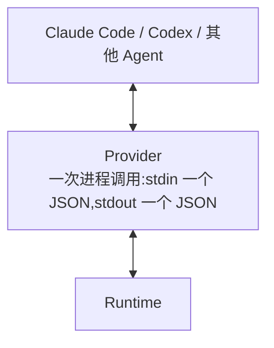

# Provider 架构

> Provider 层是 Harness 与 Coding Agent 之间**唯一的翻译层**,也是整个系统信任边界之外的一侧。
>
> stdin/stdout 载荷、配置类型与失败语义见 [Provider 契约](../interfaces/provider.md)。本目录只
> 回答:是什么、什么时候执行、如何参与决策。

## 1. 是什么

Provider 把 Harness 的一次「阶段请求」翻译成对某个具体 Agent 的调用,再把 Agent 的输出翻译回
Harness 能解读的响应。它是一个**函数**,不是一层框架:

Runtime 只认识「阶段请求进、结构化响应出」这一个形状。因此换一个 Agent 不需要修改 Harness。
代价是:Harness 不知道 Agent 内部发生了什么,只能观察它的输出与实际文件改动。

## 2. 什么时候执行

| 阶段 | 是否调用 Provider | 说明 |
| -------- | ----------------- | ---------------------------------------------- |
| planner | 是(external 时) | 产出实现计划 |
| coder | 是 | 唯一会改产品文件的阶段 |
| tester | 是 | 在 Harness 跑完闸门之后,判定证据是否可信 |
| reviewer | 是 | 在范围检查之后,判定变更是否满足要求 |

`mode: internal` 的阶段**不启动任何进程**,直接通过。默认的 `agents.json` 四个阶段都是 external,
但 Provider 是外部适配器,不属于任何一个发布包。

每次调用之前,Harness 先检查命令是否在 `allowedAgentCommands` 内;不在则阶段失败,进程不会被启动。

## 3. 调用形态与它的理由

| 约定 | 理由 |
| ------------------ | ------------------------------------------------------------ |
| stdin 传一个 JSON | 避免命令行长度与环境变量转义问题;载荷可以是任意深度的任务结构 |
| stdout 返回一个 JSON | Agent 的自然语言输出无法判定,必须收敛到一个可校验的对象 |
| **空 stdout 视为成功** | 内置阶段本就不产生载荷,允许 Provider 只做事不说话 |
| `cwd` 固定为项目根 | Agent 的相对路径行为可预测;Provider 不自行切换目录 |
| 不注入环境变量 | 减少隐式通道,调用所需的一切都在 stdin 里 |
| 退出码 0 表示成功 | 非零即失败,stderr 作为失败说明上报 |

载荷的判别字段是 **`phase`**;各阶段的额外字段(coder 的 `previousVerification`、reviewer 的
`fileChanges`)见契约。

## 4. 如何参与决策

**Provider 本身不参与任何判定。** 它只返回「成功/失败 + 载荷」,是否通过由两处独立逻辑决定:

| 判定 | 位置 | 依据 |
| ---------------- | -------------------- | ------------------------------------------------------------ |
| Tester 是否通过 | `core/approval-gate.ts` | Harness 的闸门结果 **且** Provider 返回的 `approved` |
| Reviewer 是否通过 | `core/approval-gate.ts` | Provider 返回的 `approved` **且** 无越界文件 |

这是刻意的边界:Provider 的返回只是**证据之一**,而不是结论。Agent 说「我做完了」不构成通过理由;
Agent 说「没问题」也不能覆盖 Harness 自己发现的范围越界。

阶段失败如何影响流程:

| 阶段失败 | 后果 |
| -------- | ------------------------------------------ |
| planner | 直接终止,不重试 |
| coder | 直接终止,不重试 |
| tester | 回到 Coder 重试,受 `maxIterations` 限制 |
| reviewer | 直接终止,不重试 |

## 5. 边界

Provider **不负责**:策略判定、范围检查、验证执行、审计记录。这些全部留在 Runtime。某个 Agent 的
特殊能力也不改变 Harness 的核心领域模型。

Provider **不追求覆盖面**。抽象的价值是可替换性,而不是支持尽量多的 Agent;模型路由同样不属于
Provider——Harness 不根据任务自动选择模型。

## 6. 当前状态与目标

当前的适配器实现(`scripts/harness/claude-adapter.ts`)是本仓库的**示例**,不是发布物,其中存在
指向仓库自身路径的硬编码与部分闸门名称的耦合。

> **目标(M13)** 建立可移植的 Agent Provider Adapter:去掉仓库路径硬编码,使适配器能作为独立
> 发布物复用。当前**未实现**。

## 7. 相关文档

- [Provider 契约](../interfaces/provider.md) — 载荷、配置与失败语义
- [系统架构](./system.md) — Provider 在分层中的位置
- [验证架构](./verification.md) — Provider 的返回如何被判定
- [Policy 架构](./policy.md) — 命令白名单如何拦截调用
