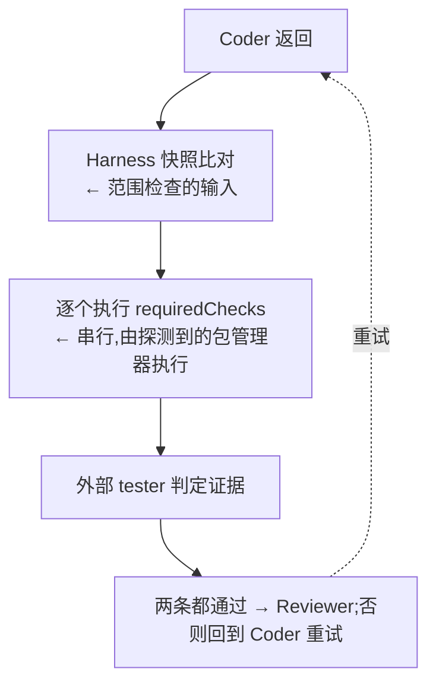

# Verification 架构

> 独立验证回答一个问题:**凭什么认为任务真的完成了。**
>
> 记录类型与通过条件见 [验证契约](../interfaces/verification.md)。本目录只回答:是什么、什么时候
> 执行、如何参与决策。

## 1. 是什么

验证是 Harness **自己执行**的检查,不是 Agent 的汇报。整个系统的信任边界只有一条规则:

> **Agent 的自我描述不是独立验证证据。**

因此 Harness 必须自己执行闸门、自己比较改动、自己记录结果。Agent 可以提供证据,但证据要经过
Harness 的执行与范围检查才能被采信。

验证只是治理链路的一段:完整的「确定性证据 → 语义审查 → 处置」三层见
[治理流水线](./governance.md)。

## 2. 两条独立的闸门

系统里有两条闸门,时机与目的都不同,容易混淆:

| | 配置闸门 | 运行闸门 |
| -------- | -------------------------------------- | -------------------------------- |
| 命令 | `pedyc-harness verify` | `pedyc-harness run` 的 Tester 阶段 |
| 时机 | 用户显式调用,或 CI | 每次运行、每轮迭代 |
| 检查什么 | 配置与 schema 是否齐全、脚本是否存在 | 脚本是否真的通过 |
| 执行产品脚本 | **否**,只断言脚本名存在 | **是**,逐个执行 |
| 可扩展 | 有:`.harness/verify.mjs` 钩子 | 无 |

配置闸门决定「能不能开始」,运行闸门决定「有没有完成」。两者都以非零退出码表示不通过。

## 3. 运行闸门什么时候执行

一次迭代内的顺序是固定的:

> **目标(M8)** 目标形态在"逐个执行 requiredChecks"之后汇总 Evidence(含 Preset 注册的确定性
> 分析器),并把 Reviewer 的输出从 `approved: boolean` 升级为 Findings 列表,由 Gate 按 Policy 的
> `severity → action` 处置。

## 4. 验证的四种形态

验证不等于「跑一条命令」。四种形态的判据、执行者与信任等级都不同:

| 形态 | 判据 | 执行者 | 信任等级 | [ADR-005](../decisions/ADR-005-semantic-governance.md) 分级 |
| ---------------- | ---------------------------------- | ------------------------------ | ------------------ | ------------ |
| 命令验证 | 进程退出码 | Harness | `harness-executed` | Level 0 |
| 结构验证 | 解析产物上的约束(AST / JSON / CSS) | Harness 或 Preset 注册的分析器 | `analyzer-derived` | Level 0 |
| 启发式 | 可解释的分数 + 贡献项 | Harness | `analyzer-derived` | Level 1 |
| 语义审查 | 需要理解意图 | Harness 调度,Provider 执行 | `review-derived` | Level 2 |

**今天只有第一种。** `requiredChecks` 是包脚本名,由包管理器执行;退出码之外的事实——例如改动后的
CSS 里 `animation-duration: 1s`——没有任何东西会去看。结构验证是 M8 的增量:分析器只产出事实,
规则只做比较,两者可以由不同的包分别提供。

术语纪律:**「语义」只指需要模型的那一类**。用 AST 读出属性值属于结构验证,不叫 semantic
verification——否则它会与触发条件、预算和信任等级冲突。定义与判定链路见
[ADR-007](../decisions/ADR-007-rule-kinds-and-constraints.md)。

## 5. 如何参与决策

通过条件是两个**独立**条件的合取:

| 条件 | 由谁给出 |
| -------------------------------- | -------------- |
| 所有闸门的结果都是 `pass` | Harness 执行得出 |
| 外部 tester 返回 `approved: true` | Agent 判定 |

第二个条件不能替代第一个:Agent 认可一套全红的闸门也不会通过。反过来,闸门全绿但 tester 拒绝,
同样不通过。两者缺一不可。

一个容易忽略的推论:没有配置任何闸门时,「全部通过」是**空真**,因此 `requiredChecks` 为空等于
验证形同虚设。

失败后的流程:回到 Coder 重试,上限为 `min(input.maxIterations, policy.maxIterations)`,缺省 3。
Coder 会收到上一轮完整的闸门结果,这是失败原因回流给 Agent 的**唯一通道**。

## 6. 两个角色必须区分

| 角色 | 是谁 | 做什么 |
| ---------- | -------------- | ---------------------------------------------- |
| Validator | Harness | 执行闸门、比对改动、记录结果 |
| Tester | 外部 Agent | 阅读 Harness 给出的证据,表示认可或拒绝 |

把「执行」留给 Harness、把「认可」交给 Agent,是这套设计的核心:`approved` 可以被 Agent 影响,
但闸门结果不能。

> **目标(M8)** Reviewer 的目标输出是**结构化 Findings**(rule id、目标、级别、说明、是否可修复),
> 而不是一句批准;它与 Coder 的**同源问题**(是否同一 Provider、同一模型)也需要可声明、可审计。

## 7. 证据当前记什么

一条闸门的结果只有三个字段:可读命令、`pass`/`fail`、说明文本。落盘位置是
`.harness/runs/<runId>/iteration-<n>-verification.json`。

> **目标(M8)** 下列内容**未实现**:退出码的结构化记录、stdout 留存与截断策略、每条闸门的耗时与
> 时间戳、统一的证据模型与持久化、证据的**信任等级**(`harness-executed` / `analyzer-derived` /
> `review-derived` / `agent-claimed`),以及 Preset 注册的 Evidence Provider。
>
> 因此当前只做到了**结果层面的独立执行**,尚未做到**过程层面的可复核**。这是本组件已知的最大缺口。

还有一处需要留意:运行级 `status` 由「编排是否完成」派生,不是由证据评估派生。也就是说
`passed` 表示流程走通了,不表示某一套证据被独立复核过。

> **目标(ADR-006)** 把「循环为什么停下」(`termination`)与「治理结论是什么」(`verdict`)从
> `status` 里拆出来,见 [Governance Runtime 架构](./runtime.md)。

## 8. 失败模式

| 失败 | 表现 |
| -------------------- | -------------------------------------------------- |
| 闸门脚本不存在 | 配置闸门失败,并列出缺失的脚本名 |
| 闸门非零退出 | 该条记为 `fail`,说明取 stderr |
| 结构验证发现约束不满足 | 产生 `analyzer-derived` 的 Finding,按 severity 处置(**目标 M8**) |
| 外部 tester 拒绝 | 即使闸门全绿也判定不通过 |
| 超出重试上限 | 运行失败,记录「未在上限内通过验证」 |
| 改动越界 | Reviewer 阶段判定不通过,即使 Agent 已批准 |

## 9. 边界

验证**不负责**:决定允许改什么(那是 Policy)、调用 Agent(那是 Provider)、维护完整审计链
(未实现)。它只回答「这次检查通过了吗」,并把结果交给编排层决定后续行为。

## 10. 相关文档

- [验证契约](../interfaces/verification.md) — 记录类型、通过条件与重试上限
- [治理流水线](./governance.md) — Evidence / Review / Gate 三层的完整链路
- [Governance Runtime 架构](./runtime.md) — 验证在编排阶段中的位置
- [系统架构](./system.md) — 四阶段循环中的位置
- [Policy 架构](./policy.md) — `requiredChecks` 来自哪里、范围检查如何协作、Findings 如何被处置
- [Preset 架构](./preset.md) — 分析器与检查声明如何被 Preset 注册
- [Provider 架构](./provider.md) — tester 阶段的调用形态
- [ADR-007](../decisions/ADR-007-rule-kinds-and-constraints.md) — 规则种类与可执行约束
