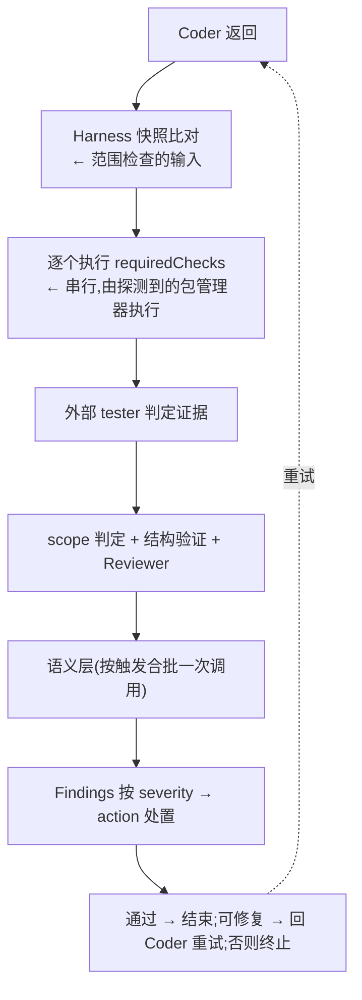

# Verification 架构

> 独立验证回答一个问题:**凭什么认为任务真的完成了。**
>
> 记录类型与通过条件见 [验证契约](../interfaces/verification.md)。本目录只回答:是什么、什么时候
> 执行、如何参与决策。

## 1. 是什么

验证是 Harness **自己执行**的检查,不是 Agent 的汇报。整个系统的信任边界只有一条规则:

> **Agent 的自我描述不是独立验证证据。**

因此 Harness 必须自己执行闸门、自己比较改动、自己记录结果。Agent 可以提供证据,但证据要经过
Harness 的执行与范围检查才能被采信。

验证只是治理链路的一段:完整的「确定性证据 → 语义审查 → 处置」三层见
[治理流水线](./governance.md)。

## 2. 两条独立的闸门

系统里有两条闸门,时机与目的都不同,容易混淆:

| | 配置闸门 | 运行闸门 |
| -------- | -------------------------------------- | -------------------------------- |
| 命令 | `pedyc-harness verify` | `pedyc-harness run` 的 Tester 阶段 |
| 时机 | 用户显式调用,或 CI | 每次运行、每轮迭代 |
| 检查什么 | 配置与 schema 是否齐全、脚本是否存在 | 脚本是否真的通过 |
| 执行产品脚本 | **否**,只断言脚本名存在 | **是**,逐个执行 |
| 可扩展 | 有:`.harness/verify.mjs` 钩子 | 无 |

配置闸门决定「能不能开始」,运行闸门决定「有没有完成」。两者都以非零退出码表示不通过。

## 3. 运行闸门什么时候执行

一次迭代内的顺序是固定的:

Evidence 在 C 与 E 两处产生(命令闸门与确定性分析器),Reviewer 与语义层的产出是 Findings,
处置统一由 Policy Evaluator 给出。

## 4. 验证的四种形态

验证不等于「跑一条命令」。四种形态的判据、执行者与信任等级都不同:

| 形态 | 判据 | 执行者 | 信任等级 | [ADR-005](../decisions/ADR-005-semantic-governance.md) 分级 |
| ---------------- | ---------------------------------- | ------------------------------ | ------------------ | ------------ |
| 命令验证 | 进程退出码 | Harness | `harness-executed` | Level 0 |
| 结构验证 | 解析产物上的约束(AST / JSON / CSS) | Harness 或 Preset 注册的分析器 | `analyzer-derived` | Level 0 |
| 启发式 | 可解释的分数 + 贡献项 | Harness | `analyzer-derived` | Level 1 |
| 语义审查 | 需要理解意图 | Harness 调度,Provider 执行 | `review-derived` | Level 2 |

**今天实现的是命令验证、结构验证与语义审查三类**(启发式没有引擎,声明它会被拒绝)。
命令验证是 `requiredChecks` 的包脚本;结构验证由 `verification` 文档声明的约束与内置分析器
(`css.duration`、`json.property`)完成;语义审查由 Harness 按触发条件合批一次调用,产出
`review-derived` 的 Findings。

术语纪律:**「语义」只指需要模型的那一类**。用 AST 读出属性值属于结构验证,不叫 semantic
verification——否则它会与触发条件、预算和信任等级冲突。定义与判定链路见
[ADR-007](../decisions/ADR-007-rule-kinds-and-constraints.md)。

## 5. 如何参与决策

通过条件是若干**独立**条件的合取:

| 条件 | 由谁给出 |
| -------------------------------- | -------------- |
| 所有闸门的结果都是 `pass` | Harness 执行得出 |
| 外部 tester 返回 `approved: true` | Agent 判定 |
| 存在可判定的 Evidence | Harness 判定 |
| 范围判定允许(无被拒文件) | Harness 判定(`judgeScope`) |
| 没有 `reject` 处置的 Finding | Policy Evaluator |

任何一个条件都不能替代另一个:Agent 认可一套全红的闸门也不会通过;闸门全绿但越界同样不通过;
没有证据时 Reviewer 不得批准。

失败后的流程:回到 Coder 重试,上限为 `min(input.maxIterations, policy.maxIterations)`,缺省 3。
Coder 会收到上一轮完整的闸门结果与**结构化 Findings**,这是失败原因回流给 Agent 的两条通道。

## 6. 两个角色必须区分

| 角色 | 是谁 | 做什么 |
| ---------- | -------------- | ---------------------------------------------- |
| Validator | Harness | 执行闸门、比对改动、记录结果 |
| Tester | 外部 Agent | 阅读 Harness 给出的证据,表示认可或拒绝 |

把「执行」留给 Harness、把「认可」交给 Agent,是这套设计的核心:`approved` 可以被 Agent 影响,
但闸门结果不能。

Reviewer 的目标输出是**结构化 Findings**(rule id、目标、级别、说明、是否可修复),`approved`
只作为兼容字段保留。它与 Coder 的**同源问题**(是否同一 Provider、同一模型)由
`agents.json` 的 `source` 声明并写进 `RunResult.independence`——可审计,但今天不强制:
所有阶段共用一个 provider 仍是合法配置。

## 7. 证据记什么

一条命令闸门的证据包含:可读命令、退出码、耗时、起止时间、stdout/stderr 的截断副本与覆盖全文的
`sha256` 摘要、来源(`source`)与**信任等级**(`trust`)。结构验证的事实记为 `analyzer-derived`,
语义审查的结论记为 `review-derived`,被检查方的自述记为 `agent-claimed`(只作线索,不参与判定)。
落盘位置是 `.harness/runs/<runId>/iteration-<n>-verification.json`(该轮的 `Evidence[]`)与
`output.json` 的 `evidence`。

运行级 `status` 仍由「编排是否完成」派生,不是由证据评估派生:也就是说 `passed` 表示流程走通了,
不表示某一套证据被独立复核过。逐条判定在 `violations` / `findings` / `scope` 里。

> **目标(ADR-006)** 把「循环为什么停下」(`termination`)与「治理结论是什么」(`verdict`)进一步
> 拆开,见 [Governance Runtime 架构](./runtime.md)。`termination` 已实现。

## 8. 失败模式

| 失败 | 表现 |
| -------------------- | -------------------------------------------------- |
| 闸门脚本不存在 | 配置闸门失败,并列出缺失的脚本名 |
| 闸门非零退出 | 该条记为 `fail`,说明取 stderr |
| 结构验证发现约束不满足 | 产生 `analyzer-derived` 的 Finding,按 severity 处置 |
| 声明的约束无法求值 | 报错并终止(`policy_violation`),不静默通过 |
| 语义预算耗尽 | `warning` 记 `skipped`, `error` fail-closed |
| 外部 tester 拒绝 | 即使闸门全绿也判定不通过 |
| 超出重试上限 | 运行失败,记录「未在上限内通过验证」 |
| 改动越界 | 独立判定不通过,即使 Agent 已批准 |

## 9. 边界

验证**不负责**:决定允许改什么(那是 Policy)、调用 Agent(那是 Provider)、维护完整审计链
(未实现)。它只回答「这次检查通过了吗」,并把结果交给编排层决定后续行为。

## 10. 相关文档

- [验证契约](../interfaces/verification.md) — 记录类型、通过条件与重试上限
- [治理流水线](./governance.md) — Evidence / Review / Gate 三层的完整链路
- [Governance Runtime 架构](./runtime.md) — 验证在编排阶段中的位置
- [系统架构](./system.md) — 四阶段循环中的位置
- [Policy 架构](./policy.md) — `requiredChecks` 来自哪里、范围检查如何协作、Findings 如何被处置
- [Preset 架构](./preset.md) — 分析器与检查声明如何被 Preset 注册
- [Provider 架构](./provider.md) — tester 阶段的调用形态
- [ADR-007](../decisions/ADR-007-rule-kinds-and-constraints.md) — 规则种类与可执行约束
