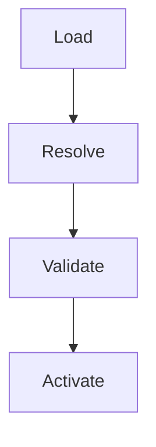
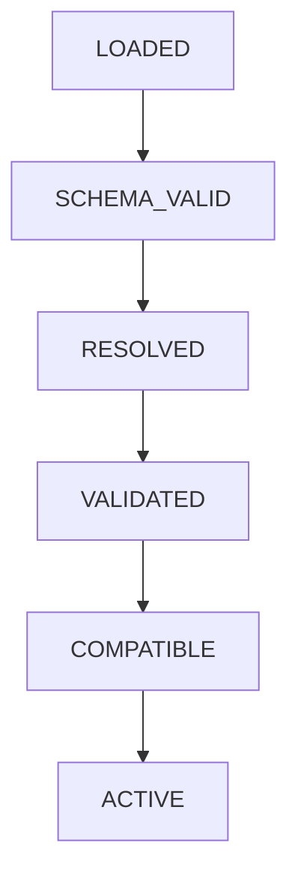
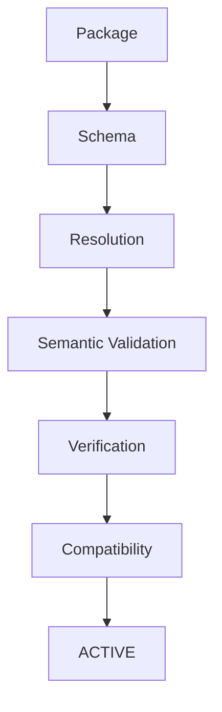

# ADR-002 — Preset Validation & Resolution

* **Status:** Accepted
* **Date:** 2026-09-17
* **Refines:** [ADR-001](./ADR-001-preset-resolution.md)

## 1. Context

`pedyc-harness` 支持第三方 Preset，但 Preset 不能默认被信任。

Preset 可能存在：

* Schema / Contract 不兼容
* Dependency 循环或缺失
* Policy / Rule 冲突
* Verification 无法执行
* 与当前项目环境不兼容

因此需要在 Preset 生效前建立统一的 **Resolution + Validation** 机制。

---

## 2. Decision

采用：

### Resolution

负责确定：

* Preset Dependency
* Dependency Graph
* Resolution Order
* Governance Composition
* Provenance

使用 DAG + Topological Sort，并拒绝 Dependency Cycle。

### Validation

负责检查：

* Schema / Contract
* Dependency
* Policy / Rule 冲突
* Harness / Runtime / Project Compatibility
* Verification Definition

其中动态 Verification 不在安装时自动执行，需要显式触发。

---

## 3. Preset Lifecycle

任一关键阶段失败，则 Preset 不得进入 `ACTIVE`。

---

## 4. Trust Model

Harness 不直接信任第三方 Preset，而是逐层建立信任：

Preset 可以提供 Domain-specific Validator，但必须遵守 Harness 定义的 Validator Contract。

---

## 5. Consequences

### Positive

* 第三方 Preset 有统一的合法性检查
* Preset 冲突可以在 Agent 执行前发现
* Resolution 结果可追踪、可审计
* Core 与 Domain Validator 保持解耦

### Negative

* Preset 加载流程更加复杂
* 需要维护 Preset / Verification Contract
* 动态验证会增加运行成本

---

## 6. Core Principle

> **Preset 声明 Governance，Harness 负责 Resolve 和 Validate，只有通过验证的 Governance 才能进入 Agent Runtime。**
