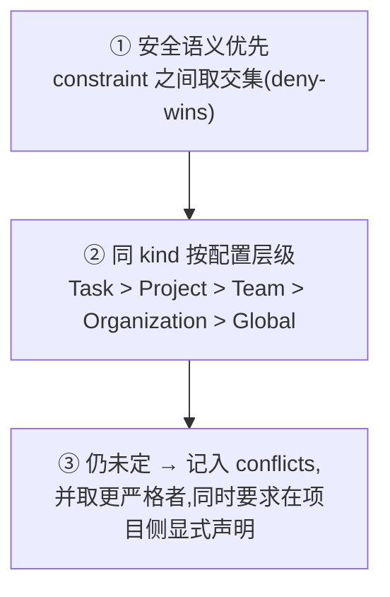
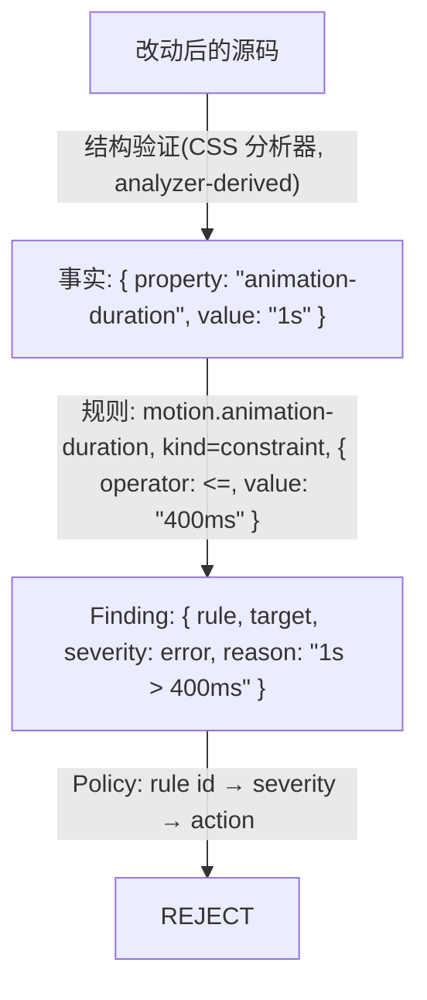

# ADR-007 — 规则种类与可执行约束

* **Status:** Accepted
* **Date:** 2026-09-17
* **Related:** [ADR-004](./ADR-004-policy-severity-rules.md)（本 ADR 补全其规则模型）、[ADR-005](./ADR-005-semantic-governance.md)（验证分级）、[ADR-003](./ADR-003-preset-as-code.md)

## 1. Context

ADR-004 定下了 `rule id → severity → action`，但没有回答两件事：

1. **规则之间如何分类。** 现在只有「字段级 Merge Strategy」这张表（[Preset 设计](../architecture/preset.md) §11），
   它是**机制**，不是原则：遇到一个新规则，没人能说清该给它哪种策略，只能逐字段讨论。
2. **规则怎么携带约束。** `animation-duration <= 400ms` 这样的规则，今天没有可写的地方——ADR-004 只给了
   `Finding`（判定结果），没给判定所依据的**事实**与**约束**。

一个真实例子就能暴露缺口。项目同时装了 motion 与 minimal-design 两个 Preset：

```text
motion-preset          动画时长 150–400ms
minimal-design-preset  动画时长 ≤ 300ms
```

今天的结果是：只有**最后一个**声明了 policy 的 Preset 生效，另一份被整份忽略——既没有冲突报告，也没有
"为什么是它赢"的记录。而 `1s` 这种实际违规，Runtime 也无法发现：现有验证只有一种形态（`requiredChecks`
里的**包脚本名**），没有任何东西会去读改动后的 CSS 并算出 `duration = 1s`。

## 2. Decision

### 2.1 四种规则种类

| kind | 含义 | 默认合并语义 | 默认 severity | 能否被更高层放宽 |
| -------------- | -------------------------- | ---------------------- | ------------- | ---------------- |
| `constraint` | 必须满足 | `deny-wins`（取交集） | `error` | ❌ 只能收紧 |
| `preference` | 建议，可以同时存在 | `append` | `info` | ✅ 可被项目关闭 |
| `instruction` | 给 Agent 的上下文 | `append`（去重） | — | ✅ 项目所有 |
| `verification` | 检查定义 | `union`（全部执行） | `warning` | ✅ 可被项目停用 |

**合并语义由 kind 决定，不由字段名决定。** §11 的逐字段策略表因此变成 kind 的推论，而不是需要每次
重新讨论清单。

`preference` 与 `instruction` 的关键区别在**消费者**：前者进判定（作为 `info` 记录），后者只进
Agent 的上下文，且（今天）通过项目自己的 `AGENTS.md` 到达 Agent——见 §2.5。

### 2.2 约束是可执行的声明，不是自然语言

```ts
type ConstraintOperator = '<=' | '>=' | '<' | '>' | '==' | 'in' | 'not-in'

interface Constraint {
  target: 'css' | 'json' | 'text' | 'dependency' | 'path' | string
  property: string                  // 例如 "animation-duration"
  operator: ConstraintOperator
  value: string | number | readonly string[]
}
```

`rules: ["动画应该比较短"]` 这种自然语言规则**不可执行**，只能作为 `instruction` 存在，不能作为
`constraint`。

**这不违反 ADR-004 的「不引入 DSL」**：那条约束针对的是 **Policy 的处置侧**——`policy.json` 里不写
条件表达式。这里允许的是**检测侧的声明**：一个检查声明自己依据什么事实、与什么值比较。Policy 仍然只
回答「这条 rule id 有多严重、该怎么处置」。

声明式约束有明确的表达力上限：它只能表达「从产物里取出一个属性，与一个值比较」。任何需要计算、
跨文件推理或理解意图的规则，必须由实现（分析器或语义审查）给出事实，而不是硬塞进声明。

### 2.3 冲突必须被记录，而不是静默解决

规则冲突按下面的顺序判定：



第 ③ 步不能只"取更严格者"就算完：**必须记录**，否则审计无法回答「为什么 300ms 赢了 400ms」。因此
编译产物带一个 `conflicts` 字段——这正是 [Preset 设计](../architecture/preset.md) §11 里 deny-wins
静默生效所缺的那一半。

> **目标(M17、M19)** `conflicts` 与合并语义均**未实现**。

### 2.4 验证的四种形态

| 形态 | 判据 | 执行者 | 信任等级 | ADR-005 分级 |
| ---------------- | -------------------------------- | ------------------------------ | ------------------ | ------------ |
| 命令验证 | 进程退出码 | Harness | `harness-executed` | Level 0 |
| 结构验证 | 解析产物上的约束（AST / JSON / CSS） | Harness 或 Preset 注册的分析器 | `analyzer-derived` | Level 0 |
| 启发式 | 可解释的分数 + 贡献项 | Harness | `analyzer-derived` | Level 1 |
| 语义审查 | 需要理解意图 | Harness 调度，Provider 执行 | `review-derived` | Level 2 |

**术语纪律：「语义」只指需要模型的那一类。** 用 AST 读出 `duration = 1s` 属于**结构验证**，不叫
"semantic verification"——否则它会与 ADR-005 的触发条件、预算与信任等级直接冲突。
术语的完整对照见 [核心概念 §5](../核心概念.md)。

一次典型的判定链路：



分析器**不认识规则**，规则**不认识语法**：分析器只产出事实，规则只做比较。这样第三方可以只发布
分析器（纯计算、无网络，满足 ADR-003 §2.6 的资源分类），也可以只发布规则。

### 2.5 instruction 仍然停在 init

Preset 的 `instruction` 由 `init` 用来**播种项目的 `AGENTS.md`**，运行时**不做指令注入**：项目拥有
`AGENTS.md`，Preset 的文本只是它第一次被写出来时的种子。

要做到"运行时把多个 Preset 的指令合并进阶段请求"，需要新增字段、provenance 与记录，并正面回答它与
[项目目标](../项目目标.md) 原则 7（项目规则属于项目本身，不藏在 npm 包里）的冲突。本 ADR 决定：
**不做**。多个 Preset 的 instruction 依然按"最后一个声明者胜出"选一份。

## 3. Consequences

### Positive

* 新规则该用什么合并语义、什么严重级别，由 kind 直接推导，不再逐字段争论。
* `1s > 400ms` 这类违规第一次有了可执行的落点，而且判定链路每一段都可独立审计。
* 冲突可见：`conflicts` 让"谁赢了、为什么"从静默变成记录。
* 四类验证映射到 ADR-005 的三级，因此触发条件、信任等级与成本模型不必重造一套。

### Negative

* `kind` 成为跨包契约，需要命名与版本约定（Preset 声明 kind，项目只能收紧 severity）。
* 声明式约束的表达力上限必须写进文档，否则会被当成通用规则引擎使用。
* `conflicts` 与 provenance 让编译产物变大，M9 的记录 schema 需要容纳它。

## 4. Alternatives

| 方案 | 为什么没选 |
| -------------------------------------------- | ------------------------------------------------------------ |
| 用 `priority` 数字解决所有冲突 | 数字无法解释"为什么这条规则应该覆盖另一条"；审计上等于没有理由 |
| 维持逐字段 Merge Strategy 表 | 没有原则，每加一个规则都要重新讨论一次策略 |
| 让 Policy 支持条件表达式 | 处置侧一旦承载匹配逻辑，安全约束的合并（deny-wins）就无法静态判定 |
| 让 Preset 直接实现全部规则（连事实提取一起） | 规则不可声明、不可静态审计；分析器也无法被别的 Preset 复用 |
| 运行时合并多个 Preset 的 instruction | 越过"项目规则属于项目本身"，并让阶段请求变成隐式 prompt 拼装 |

## 5. Core Principle

> **规则按种类合并，按事实判定：kind 决定怎么合，分析器给事实，规则做比较，Policy 定处置。**
