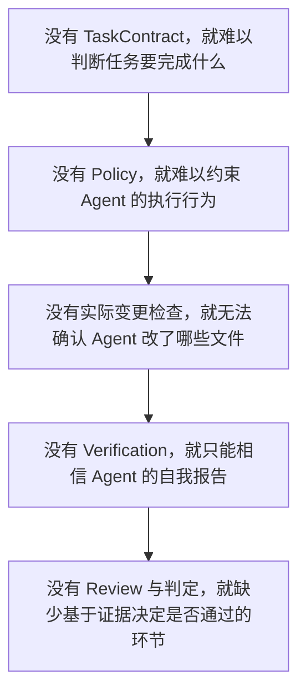

# 核心概念与术语

> 本文件是项目的**术语表**：每个概念给出中文理解、**成熟状态**与**真实实现名**。
>
> 它的用途是阻止语义偏移——同一个东西被叫成三个名字，或者一个尚未实现的设计被当成现状引用。
> 因此每条都带 `状态` 列：`已实现` 表示今天能被引用，`目标(Mxx)` 表示只有设计、没有实现。
>
> **字段表不在这里。** 字段的类型、必需性与逐条约束属于 [接口契约](./interfaces/README.md)；
> 本文件只回答「这个词指什么、现在有没有」，避免出现第三份字段说法。

## 1. 任务定义与治理

| 概念         | 中文理解 | 状态                        | 真实实现 / 出处                                                        |
| ------------ | -------- | --------------------------- | ---------------------------------------------------------------------- |
| Task         | 任务     | 已实现                      | `NormalizedTask`（输入侧 `RawTaskInput`、`IntakeResult`），`task.schema.json` |
| TaskContract | 任务契约 | 已实现（概念名，无同名类型）| 由 `NormalizedTask` 承载：目标、约束、验收标准、验证提示、迭代上限      |
| Policy       | 执行策略 | 已实现                      | `Policy`；文档 `.harness/policy.json`；Schema `policy.schema.json`      |
| Preset       | 预设     | 已实现（数据包）            | `PresetManifest`、`ResolvedPreset`、`preset.json`；**携带代码入口是 M21 目标** |
| Severity     | 严重级别 | 已实现（作为判定字段）      | `'error' \| 'warning' \| 'info'`，见 §5                                 |
| Rule         | 规则     | **目标(M8)**                | 无实现：`knownRules` 为空，`policy.json` 不接受 `rules`；见 [ADR-008](./decisions/ADR-008-policy-scope-and-deferred-rule-disposition.md) |

其中 `TaskContract` 没有同名类型：它是**概念**，由 `NormalizedTask` 的字段承载。引用时写
`NormalizedTask`，不要写 `TaskContract`。

> TaskContract 与 Policy 是治理的两半：前者说「要完成什么」，后者说「允许怎么做」。

## 2. 执行与适配

| 概念            | 中文理解     | 状态                            | 真实实现 / 出处                                                  |
| --------------- | ------------ | ------------------------------- | ---------------------------------------------------------------- |
| Harness Runtime | 运行时       | 已实现（架构分层）              | `packages/core/src/runtime/`；无单一类型                          |
| Agent           | 智能体       | 已实现（外部进程）              | Claude Code、Codex 等；Harness 不实现它                           |
| Provider        | 执行提供方   | 已实现                          | `ProviderConfig`（`command` + `args`），`.harness/agents.json` 的 `providers` |
| AgentAdapter    | Agent 适配器 | 已实现（协议）／类型名属 M13    | 适配器就是那个外部进程；`AgentAdapter`、Adapter Factory 等**名字属 M13 目标形态**，当前不存在 |
| Executor        | 执行器       | 已实现（无 `Executor` 类型）    | `runOrchestrator`（`runtime/executor.ts`）                        |
| Stage           | 阶段         | 已实现（**契约**）              | `AgentRole`：`planner` / `coder` / `tester` / `reviewer`，见 §5    |

`Stage` 的四个名字是契约而非实现细节：它们同时是 `AgentRole`、`agents.json` 的键、
`StageRequest.phase` 的判别字段，也是 `--dry-run` 输出里被测试直接断言的记录。改名会同时打破
这几处，见 [ADR-006](./decisions/ADR-006-run-lifecycle.md) §2.1。

## 3. 变更检查与结果验证

| 概念                  | 中文理解 | 状态                  | 真实实现 / 出处                                                     |
| --------------------- | -------- | --------------------- | ------------------------------------------------------------------- |
| Diff                  | 变更差异 | 已实现（无 `Diff` 类型）| `snapshotFiles` + `changedFiles`，`FileSnapshot`（`diff-inspector.ts`） |
| Scope Enforcement     | 范围约束 | 已实现（M7、M8）      | `judgeScope`（`runtime/scope.ts`）独立执行并单独报告；`evaluateFiles`、`refusedFiles`、`describeFileViolations` 给出判定；规则 id `allowedProductPaths` 与 `protectedPaths` |
| Verification          | 独立验证 | 已实现                | `requiredChecks` 逐个执行；结果类型 `VerificationCheck`（旧投影）      |
| Verification Evidence | 验证证据 | 已实现（M8）          | `Evidence`（`contracts/evidence.ts`）：`id` / `source` / `trust` / 退出码 / 耗时 / 输出摘要；`VerificationCheck` 是它的投影 |
| Review                | 结果审查 | 已实现（M8）          | Reviewer 返回结构化 `findings`（`contracts/finding.ts`）；`approved` 仅作兼容字段 |
| Finding 处置          | 判定处置 | 已实现（M8）          | `evaluateFindings` 解析 `severity → action`；`policy.rules` / `severityActions` 只能收紧 |
| Gate                  | 审批门禁 | **未定稿**            | 只出现在 [治理流水线](./architecture/governance.md) 的三层链路；M13 要求「移除固定 Gate 名称约定，或写入协议」 |

> Agent 声称完成任务，不等于 Harness 已确认任务完成。
>
> 例如 Agent 声称测试通过，但 Harness 没有拿到实际执行结果，就不能仅凭这句话认定测试通过。

判定的最终解释权在 Harness：`reviewerVerdict` 要求 reviewer 批准**且**存在可判定的证据，
`judgeScope` 独立判定范围，`findingVerdict` 要求没有 `reject` 处置的 Finding——三者是各自记录的
独立事实，Agent 的 `approved` 不能抵消其中任何一项。

## 4. 配置、审计与结果

| 概念              | 中文理解 | 状态           | 真实实现 / 出处                                                        |
| ----------------- | -------- | -------------- | ---------------------------------------------------------------------- |
| Harness Manifest  | Harness 清单 | 已实现     | `HarnessManifest`；`.harness/harness.json`；Schema `harness.schema.json` |
| Config Resolution | 配置解析 | 已实现（部分） | `loadHarnessConfig`：**整份文档的来源选择**（Manifest → 约定路径 → Preset → 内置默认值） |
| Effective Policy  | 生效策略 | **目标(M17)**  | 无实现：今天没有**字段级合并**，项目的 `policy.json` 会整份压过 Preset |
| Execution Trace   | 执行轨迹 | **目标(M9)**   | 无实现                                                                  |
| Audit             | 审计     | **目标(M9)**   | 无实现                                                                  |
| Run Result        | 运行结果 | 已实现         | `RunResult`（写入 `output.json`，匹配 `output.schema.json`）            |
| RunRecord         | 运行记录 | **目标(M9)**   | 无实现；与 `RunResult` 是两个读取面，见 §5                              |

> **`Effective Policy` 目前是个容易被误用的词。** 今天解析出的只是「哪一份文档生效」，
> 不是合成结果；`getting-started.md` §4 专门记录了这一点。要引用合成后的配置，
> 必须等到 M17，并写作 `EffectiveHarnessConfig`。

以上概念不是彼此独立的功能清单，而是有依赖关系的：

## 5. 最容易混的几组词

这几组是实际发生过偏移的地方，逐条钉住：

| 容易混的两者 | 区别 | 出处 |
| ------------ | ---- | ---- |
| **结构验证** vs **语义验证** | 用 AST 提取属性值属于**结构验证**，**不叫 semantic**；「语义」只指**需要模型**的那一类 | [ADR-007](./decisions/ADR-007-rule-kinds-and-constraints.md) |
| **`RunResult`** vs **`RunRecord`** | 前者是治理结论的**快速读取面**，后者是**完整审计**；两者不得混用一个 schema | [ADR-006](./decisions/ADR-006-run-lifecycle.md) §2.5 |
| **`status`** vs **`termination`** | 前者回答「是否走完并产出结论」，后者回答「**循环为什么停下**」；正交，且循环未运行时 `termination` 不写 | [ADR-006](./decisions/ADR-006-run-lifecycle.md) §2.2 |
| **`RuleAction`** vs **`onViolation`** | `RuleAction`（`reject` / `review` / `report`）是**单条判定的处置**；`onViolation`（`fail` / `report`）决定**违规是否升级为运行失败**。后者**永不解除**对危险副作用的控制：被拒命令在任何模式下都不会启动 | [ADR-006](./decisions/ADR-006-run-lifecycle.md) §2.3 |
| **越界** vs **受保护路径命中** | 两者都会拒绝改动，但**分开报告**：受保护路径通常就在允许集合**之内**，说成「越界」会误导 | `policy-engine.ts` |
| **`approved`** vs **Harness 判定** | `approved` 是 Agent 的声明；最终判定由 Harness 给出，Agent 的话不能抵消越界或缺失证据 | `approval-gate.ts` |

## 6. 待收敛的命名

一处现有漂移，记录在此以免继续扩散：`packages/core/src/contracts/validation.ts` 定义的类型叫
**`VerificationCheck`**，而文档目录叫 `interfaces/verification.md`、里程碑里叫 Verification、
策略字段叫 `requiredChecks`。三者指的是同一件事，但名字不一致。收敛方向由 M8 定——M8 会引入
结构化证据，届时 `VerificationCheck` 的形状本身也要变。

## 7. 相关文档

- [项目目标](./项目目标.md) — 项目定位与设计原则
- [接口契约](./interfaces/README.md) — 字段表与类型签名（本文件不重复它们）
- [系统架构](./architecture/README.md) — 一次 Run 的结构与执行顺序
- [里程碑路线](./milestones/milestones.md) — 状态列里的 `Mxx` 出自这里
- [ADR-007](./decisions/ADR-007-rule-kinds-and-constraints.md) — 规则种类与术语纪律
- [文档规范](./CONVENTIONS.md) — 书写规则
